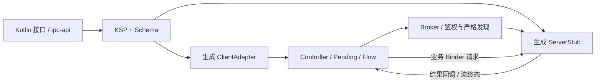

# ModernIpc

Android Binder IPC SDK 与示例工程：用 Kotlin 接口和注解描述业务，KSP 生成客户端代理、服务端 Stub 与逐事务 Schema。支持 suspend RPC、短方法同步 RPC、Flow、Oneway、Broker 服务发现、生命周期管理及重连。Broker 使用 AIDL，业务接口无需逐个编写 AIDL。

## 文档入口

| 阅读目的 | 唯一主文档 |
| --- | --- |
| 模块、连接状态、协议与核心调用链 | [架构分析](docs/ModernIPC_Architecture.md) |
| API 接入、超时、调度、Maven 发布与消费 | [SDK 指南](docs/ModernIPC_SDK_Guide.md) |
| 四 APK 部署与会议、工单、配置、遥测案例 | [业务指南](docs/ModernIPC_Business_Interaction_Guide.md) |
| 与 AndLinker 的架构、语义、性能及迁移对比 | [库对比](docs/ModernIPC_vs_AndLinker.md) |
| 优化依据、已实施改动与剩余候选 | [优化分析](docs/ModernIPC_Optimization_Analysis.md) |
| 当前验证状态与原始证据导航 | [验证索引](docs/benchmarks/README.md) |

测试报告按问题合并为 [性能报告](docs/benchmarks/Performance_Report.md)、[回归报告](docs/benchmarks/Regression_Report.md)、[多 App 验证报告](docs/benchmarks/Multi_App_Report.md)。日期、APK、失败运行与原始样本在各报告中保留。

## 模块与调用链

| 模块 | 职责 |
| --- | --- |
| ipc-annotations / ipc-compiler | 注解、类型检查、KSP 双端代码与 Schema 生成。 |
| ipc-contract | Broker AIDL、公共协议、默认关闭的请求 trace。 |
| ipc-runtime-client | 绑定、独立有界握手与发现、请求关联、取消和重连。 |
| ipc-runtime-server | Broker、实时鉴权、请求与订阅资源管理。 |
| ipc-api | 示例契约、DTO 和生成双端实现；当前同时依赖双端 runtime。 |
| demo-app | 同包分进程示例和受控诊断入口。 |
| demo-client-common | 跨包客户端共享页面与四个业务场景。 |
| app-server、app-client1/2/3 | 中枢与三个独立包、独立 UID 的客户端。 |



源码入口：[模块配置](settings.gradle.kts)、[MessageHub 契约](ipc-api/src/main/kotlin/com/cn/ipc/api/hub/IMessageHubService.kt)、[Broker AIDL](ipc-contract/src/main/aidl/com/cn/ipc/IIpcBroker.aidl)。

## 构建与业务示例

使用 Android SDK、JDK 17 和仓库 Gradle Wrapper：

```powershell
.\gradlew.bat :demo-app:assembleDebug :app-server:assembleDebug :app-client1:assembleDebug :app-client2:assembleDebug :app-client3:assembleDebug
```

跨包示例要求同签名及 signature 绑定权限。安装、启动顺序、按钮操作、DEBUG 验收入口与每个场景的流程图统一见[业务指南](docs/ModernIPC_Business_Interaction_Guide.md)。测试设备限定小米 `925c23bb`。

| 场景 | 协作过程与完成含义 |
| --- | --- |
| 会议通知 | client1 定向发布 → client2 更新会议卡 → client1/3 收到同一指令确认。 |
| 仓储工单 | client1 分派 → client2 接单与手动完成 → client1/3 观察完成态。 |
| 配置同步 | client1 广播版本 → client2/3 更新演示卡 → 两个来源分别确认。 |
| 遥测告警 | client2 发送预置 25/35°C 样本 → client3 按 30°C 阈值分析 → 告警广播。 |

这些状态保存在 Activity 内存中。路由返回不代表消费；业务确认表示页面数据处理，未证明物理呈现、持久提交或硬件执行。SharedFlow 不补离线消息，重连不自动重放业务 RPC。

## 发布与验证状态（2026-10-09）

发布候选版 **3.0.0-rc.1**，版本分支 `codex/v3.0.0-rc.1`。七个库产物与五个Debug APK统一构建 **BUILD SUCCESSFUL in 12m34s，退出码0，429任务**；Maven内部版本、APK版本与同签名校验通过。demo APK SHA-256为 `23a2802fd636f03e5821ceaf335f73907193b27560959486605e5908f7b26701`，完整身份见[发布构建记录](docs/releases/v3.0.0-rc.1/build-result.json)，内容与迁移范围见[发布说明](.github/release-notes.md)。

**发布版安装与小米设备验收仍为NOT_RUN**。此前15:04指定小米未连接，四场景开发版22DAB065...的旧构建记录继续保留在[多App报告](docs/benchmarks/Multi_App_Report.md)。Release提供七份publication、五APK、Maven仓库、源码、证据归档及SHA-256清单；Debug签名用于示例部署。

历史 `4494F529...` APK 已通过 **64 PASS / 5 DONE** 与完整成功请求 trace；之后的握手隔离新增 9 项探针仍待设备验收。历史性能结果不能证明当前 APK 的加速或两库排名，参见[回归报告](docs/benchmarks/Regression_Report.md)和[性能报告](docs/benchmarks/Performance_Report.md)。

## 使用边界

- Async 默认 30 秒入口预算覆盖可取消冷发现和 pending；取消等待不能中断已经开始的同步 Binder 或回滚远端副作用。
- Direct 只适合后台线程中的短方法，缺少 Async 的远端取消与在途限额。Oneway 不提供业务完成回执；Main 冷缓存需先挂起预热。
- Flow 有 NEXT / COMPLETE / ERROR；默认客户端缓冲溢出报错，可选 CONFLATE。源头丢值、离线重放与可靠投递需业务另外设计。
- 严格 Schema 按连接代次缓存并双端检查；旧 Broker 不隐式降级。Parcelable 字段布局由应用维护。
- `close` 允许重新连接，`dispose` 永久释放。握手和发现各有独立 4 worker 预算，无队列；每 Stub 默认 128 个 Async 在途许可。
- AndLinker 自动回退、Rx 适配、持久可靠消息及幂等重放尚未接入。

发布配置以[脚本](build-logic/src/main/kotlin/convention.publish.gradle.kts)为准，步骤并入[SDK 指南](docs/ModernIPC_SDK_Guide.md)。归总前 25 份项目 Markdown 的原文与 SHA-256 清单保存在[归档 ZIP](docs/archive/pre-consolidation-2026-10-09.zip)；原始运行记录留在 `docs/benchmarks/runs/`。
