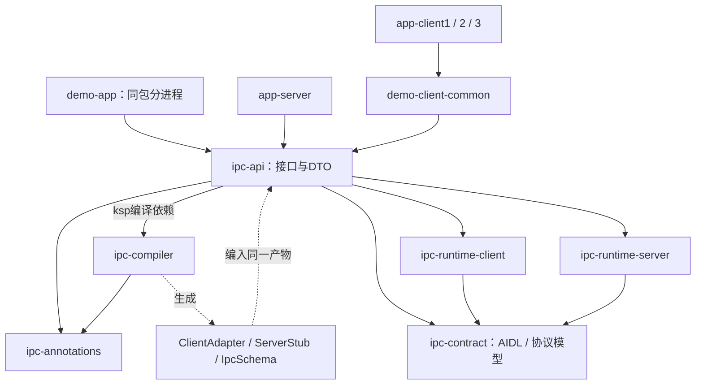
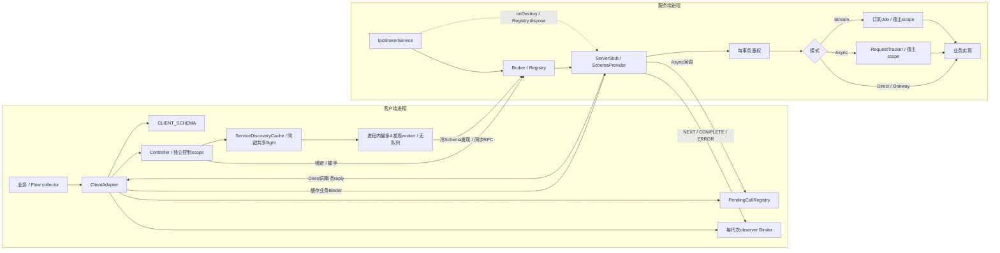
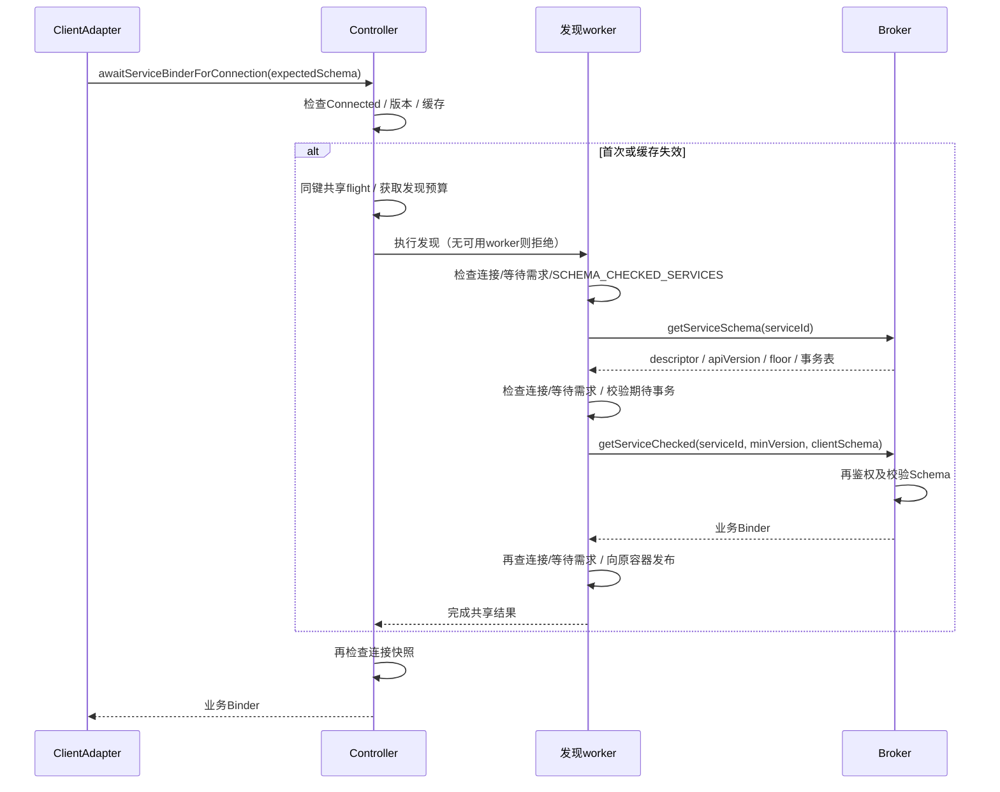
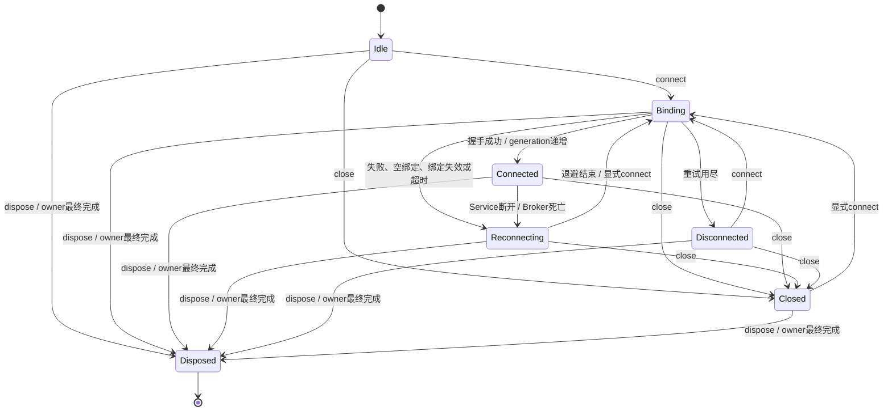
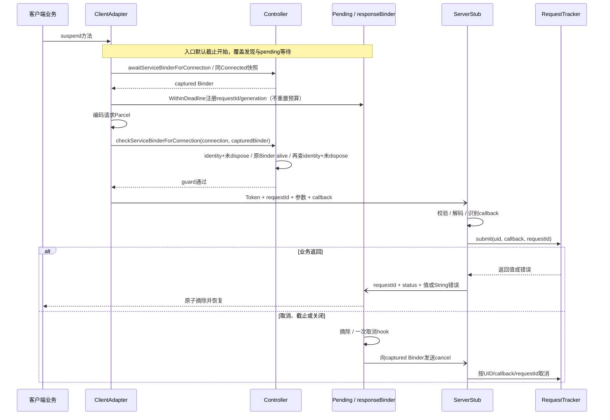
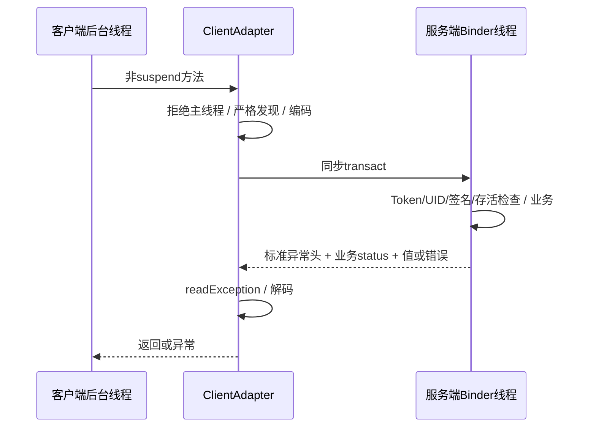
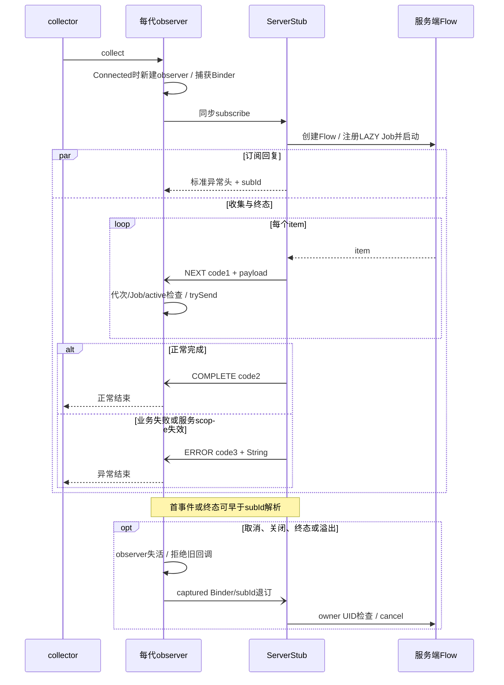
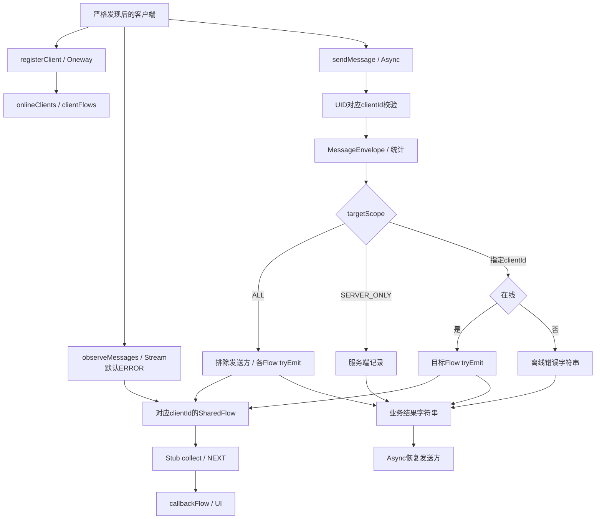
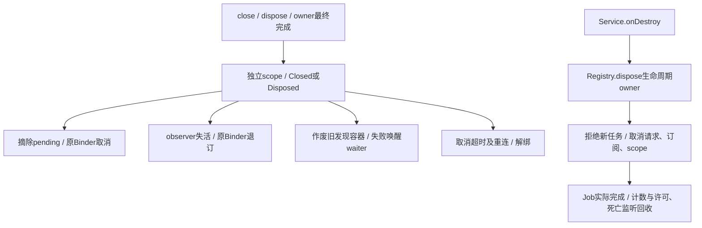

# ModernIpc 架构分析与核心调用链

发布版3.0.0-rc.1的产物与构建身份见[发布记录](releases/v3.0.0-rc.1/build-result.json)。下文设备测量与门禁仍属于各自历史APK；发布版设备验收NOT_RUN。

核对日期：2026-10-09。本文维护当前模块、生命周期、请求/流协议和严格 Schema 调用链。当前四场景 APK 仅完成构建验证，设备验收尚未运行；历史 APK 的功能与性能范围分别见[回归报告](benchmarks/Regression_Report.md)、[性能报告](benchmarks/Performance_Report.md)和[多 App 报告](benchmarks/Multi_App_Report.md)。

当前源码有独立有界 HandshakeExecutor：最多4个握手worker，绑定截止/解绑取消本地waiter，旧结果按连接与Job身份拒绝；与业务发现的4worker分池。握手隔离在4494调度实测后新增，其9项探针尚未通过设备验收，具体身份与步骤见[回归报告](benchmarks/Regression_Report.md)。

## 1. 总体架构与模块

ModernIpc 的核心是 **KSP 生成代理、Stub 和事务 Schema，AIDL Broker 负责连接与兼容服务发现，业务通过独立 Binder 与 Parcel 协议通信**。Broker 不转发每次业务调用。

| 层 | 当前实现 | 边界 |
| --- | --- | --- |
| 编译期 | 方法/事务码/共享 codec 校验；生成双端代码及 IpcSchema | Parcelable 字段不透明；注册手写；发布物未拆分 |
| 连接/发现 | 独立控制 scope、绑定超时、代次缓存、共享发现、close/dispose | 进程内最多4个发现worker、无排队；同步 Binder 不可强制取消；owner 自动释放等待最终完成 |
| 请求 | Async 入口截止覆盖冷发现和pending等待、取消、Direct 短同步、Oneway 命令 | 模式的线程、回执和配额不同；已开始的同步transact不受强制中断 |
| 流 | NEXT/COMPLETE/ERROR、旧代次过滤、捕获 Binder 退订、明确接收容量策略 | 无订阅数量上限、credit、消费 ACK 和重放 |
| 业务中枢 | 在线表、内存路由与 SharedFlow | 无持久队列、可靠投递、离线补发和心跳过期清理 |

[模块清单](../settings.gradle.kts)包含 12 个模块，另有 build-logic。图中省略外部库及应用对 runtime 的直接依赖；实线由使用方指向依赖，虚线表示生成关系。

[ipc-api](../ipc-api/build.gradle.kts)同时依赖双端 runtime 并运行 KSP，包含接口、代理和 Stub，并非纯契约包。后续可分离契约/DTO、客户端适配器、服务端 Stub，支持按侧生成；接口 Flow 仍依赖协程。拆分的 APK 体积收益需要另测。

## 2. 运行时与严格发现

生成客户端的控制链是 **bindService → handshake → getServiceSchema → getServiceChecked**；命中缓存后热路径为 ClientAdapter → 业务 Binder → ServerStub → 业务实现。

缓存键包含 `(generation, serviceId, minApiVersion, schemaFingerprint)`。ClientServiceSchema 构造时冻结事务表并计算 fingerprint，避免每次调用重算；兼容判断仍逐事务比较签名。每个键首次正常发现需要两次同步 Broker RPC，不含握手、重连或业务事务。不同期待 Schema 不能借用其他适配器的验证结果。

[ServiceDiscoveryCache](../ipc-runtime-client/src/main/kotlin/com/cn/ipc/client/ServiceDiscoveryCache.kt)将远端 RPC 移到专用 worker，map/生命周期锁内不执行 RPC。同一 Controller、同一容器和同一键共享进行中的发现；赢得新 flight 后复查缓存，避免发现完成边界的重复查询。所有 Controller 在同一进程/classloader 内共享最多 4 个发现 worker，使用 SynchronousQueue，不保留排队任务；预算占满时新冷发现以 RejectedExecutionException 失败，已有温缓存仍可读取。这不是每 Stub 的 128 个 Async 许可。

awaitServiceBinderForConnection 的等待可取消，默认以 defaultCallTimeoutMs 限制；一个 waiter 退出不会取消其他 waiter，最后一个退出后将该 flight 标记为不再需要。worker 在 RPC 返回后检查连接及等待需求，停止后续发现或发布。等待取消到 finally 释放 waiter 之间仍有调度窗口，检查到下一次 RPC 之间也有竞态，不能承诺取消信号发出瞬间远端即停止。已开始的同步 Binder 不可强制中断，最多 4 个卡住 worker 仍会占用预算。

同步 getServiceBinder/getServiceBinderForConnection 仅允许温缓存立即返回或后台线程有限等待；Main 上冷解析立即失败，提示使用 awaitServiceBinderForConnection。Direct 仍整体拒绝 Main；Oneway 在 Main 上调用前需异步预热或从后台线程解析。

生成 Stub 实现 IpcServiceSchemaProvider，使用同一个 `${Iface}IpcSchema` 的 DESCRIPTOR/METHOD_SIGNATURES。宿主在 onCreateRegistry() 手工注册版本、floor 和 Binder，Schema 生成不等于自动注册。Registry 使用普通 Map，适合启动构造后读取，无动态并发注册协议。

| 组件 | 接入情况 |
| --- | --- |
| Controller、ServiceDiscoveryCache、PendingCallRegistry、IpcRequestTracker | 主调用链 |
| IpcRequestTrace | 默认关闭的有界请求诊断；小米成功串行 Echo 的完整链已验收，诊断按 APK 区分 |
| WireTypeModel、IpcSchema、SchemaProvider | 共享校验/codec与严格发现 |
| IpcServiceLifecycle / Registry.dispose | Service销毁时释放生成Stub |
| 生成callbackFlow / 订阅map | 实际Stream实现 |
| SubscriptionRegistry、FlowAdapterHelper、IpcSubscriptionManager | 独立工具，生成Stream未接入 |
| BoundedDispatcher、IpcTelemetry | 未形成默认隔离/有效指标链 |
| ModernIpcRouter、RxIpcExtensions | 未形成AndLinker自动回退；Rx实现被注释 |
| RpcError | 模型保留，实际错误仍主要为String |

## 3. 状态机、所有权与关闭

[Controller](../ipc-runtime-client/src/main/kotlin/com/cn/ipc/client/IpcConnectionController.kt)使用独立 SupervisorJob/IO 控制 scope，不作为 owner Job 的子任务。owner **最终完成**触发 dispose；阻塞子任务可能推迟该时点，显式 dispose 不依赖它。清理可在 owner 已取消后执行。

| API | 含义 |
| --- | --- |
| close / closeAndJoin | 异步关闭或等待本地关闭/解绑；Closed允许以后connect |
| dispose / disposeAndJoin | 立即禁止新连接，异步释放或等待永久释放；Disposed结束本地collector |

握手移出 Mutex，返回后重新检查实例/状态，慢握手不占住状态锁。默认 bindingTimeoutMs=5000；onNullBinding/onBindingDied 已处理。awaitConnected() 默认 5000 ms 只限制调用方等待，两者是独立计时点。默认重试最多 10 次，退避基值 500 ms、封顶 30 s，另加约 10% 抖动，单次最长退避接近 33 s；累计重连时间还包含多次退避与绑定尝试。

关闭先发布 Closed/Disposed，再替换发现缓存容器并作废旧容器，失败唤醒其 waiter，继续解绑和 pending 清理；不 join 正在执行的发现 RPC。旧 worker 仅持有旧容器，晚到结果不能写入新代次缓存，返回给调用者前仍检查 Connected 快照。closeAndJoin/disposeAndJoin 等待本地关闭，不等待底层同步 RPC 真正返回。

close/dispose 完成不等于收到远端 Job 取消 ACK；oneway 取消/退订是尽力发送。同步 Binder 调用和非协作业务不可强制中断。最后一次快照检查到 transact 仍有竞态，本地失败不证明远端未执行，也不回滚副作用。

跨包界面示例在首次/重连注册和心跳前可取消地预热严格 Hub Schema，并核对连接快照；状态变化取消旧注册任务。主动断开的 unregister 为尽力发送，Activity.onDestroy 不额外启动等待，只取消 scope/dispose；本地清理不保证服务端在线记录已移除。

## 4. 四种调用协议

下表描述不同进程；首次冷发现的 Broker RPC 仍是同步 Binder，但由有界发现 worker 执行。Async/Flow 调用方可取消其等待，同步解析调用方在后台线程等待结果。

| 模式 | Binder方式 | 业务线程 | 终结与资源 |
| --- | --- | --- | --- |
| Async | oneway请求+独立oneway回调 | 宿主scope | 默认入口截止30s覆盖冷发现+pending；另发取消；每Stub128共享许可 |
| Direct | 同步请求/reply | Binder线程 | 发现等待有限；业务transact无默认截止/远端取消；不经过tracker |
| Stream | 同步订阅+oneway事件/退订 | 工厂在Binder线程，collect在宿主scope | 发现等待有截止，业务流无整段截止；NEXT/COMPLETE/ERROR；无订阅上限 |
| Oneway | 单向请求 | Binder线程 | 无执行回执/业务取消；不经过tracker |

### 4.1 Async

生成 Async 不自动等待连接；非 Connected 立即失败。入口 withTimeout 使用 Controller.defaultCallTimeoutMs（默认 30_000），覆盖可取消的冷发现、pending 注册后的发送及回调等待；冷发现不再阻塞 Main。发现阶段超时/取消时尚无业务 requestId 或请求发送；注册后到期则摘除 pending，经原 Binder 尝试一次取消。已开始的同步 transact 不会被截止强制打断，编码等无挂起工作也不是抢占式执行。

[PendingCallRegistry](../ipc-runtime-client/src/main/kotlin/com/cn/ipc/client/PendingCallRegistry.kt)的 callSuspendWithinDeadline 是不另建计时器的底层入口，必须由调用者建立有效的外层截止并保留取消生命周期；生成器在上述入口预算内使用它。直接调用此 primitive 不会自动获得默认 30 秒截止。普通 callSuspend 仍提供默认的注册请求截止，但不会追溯覆盖手写调用者在它之前执行的发现逻辑。

当前发送顺序为**入口截止 → await完整Schema resolve并捕获Binder → WithinDeadline注册pending → 编码 → checkServiceBinderForConnection(connection, capturedBinder) → transact**。首次解析保留expectedSchema、版本/事务校验及缓存；发送前guard仅在Binder存活检查前后验证同一Connected实例identity与未dispose，中间检查原captured Binder的isBinderAlive，避免第二次完整缓存解析。guard不自动换Binder、不重放请求；失败经pending异常路径退出，取消仍发送到原Binder。检查返回到transact之间仍可断连/死亡，必须处理传输失败，不能保证远端未执行或回滚副作用。源码：[ClientAdapterGenerator](../ipc-compiler/src/main/kotlin/com/cn/ipc/compiler/ClientAdapterGenerator.kt)、[Controller](../ipc-runtime-client/src/main/kotlin/com/cn/ipc/client/IpcConnectionController.kt)。冷发现/清理门禁见[本轮报告](benchmarks/Regression_Report.md)；前序发送前guard的测量仅属于其[独立报告](benchmarks/Performance_Report.md)及APK。

[Tracker](../ipc-runtime-server/src/main/kotlin/com/cn/ipc/server/IpcRequestTracker.kt)按 UID/callback/requestId 跟踪，超限回 SERVER_BUSY，重复回 DUPLICATE_REQUEST，scope失效/已dispose回String错误。128是每Stub所有UID共享许可，不是线程池大小。正常完成不误发取消，关闭及超时通过原Binder取消；idempotent不启用自动重放/去重。

coroutineScope 是生成 Stub 的宿主配置点，runtime 不替宿主强制选择 dispatcher。[demo MyBrokerService](../demo-app/src/main/kotlin/com/cn/ipc/demo/MyBrokerService.kt)默认使用 Dispatchers.Default，另可为短任务注入专用单线程 dispatcher；两种 scope 共享 SupervisorJob，空闲时切换，测试 finally 恢复 Default，Service 销毁时取消 Job 并关闭已创建的执行器。仍通过原 Tracker 的 LAZY Job，不改 Binder 线程执行方式、调用方恢复上下文、鉴权、取消或许可。历史4494 APK两轮配置实测各28,096次、零失败，但16字符第二轮部分配对反向，因此保留默认配置；接入方式见[SDK可选调度配置](ModernIPC_SDK_Guide.md#9-可选短任务调度配置)，条件与数据见[性能报告](benchmarks/Performance_Report.md)。

可识别callback的基本类型请求可返回鉴权/非空校验错误。Parcelable先鉴权再反序列化；坏Token、损坏帧或无法定位callback仍可能无业务回包，由本地截止终结。

### 4.2 Direct

仅支持非空 String/Int/Long/Boolean/ByteArray。无Job调度、独立响应事务或Async许可；调用方与服务端Binder线程都可能被占用。Token/鉴权/解码异常只保证标准异常头，成功及捕获的业务异常才有自定义status。外层withTimeout不强制中断同步transact。真实业务Hub仍为Async，Direct主要用于[测试接口](../ipc-api/src/main/kotlin/com/cn/ipc/api/test/IBenchmarkEchoService.kt)的短方法。

### 4.3 Stream

code1布局不变，code2无payload，code3为String；只有更新的客户端解释终态。客户端/服务端各有一次终态门闩。主动退订、collector取消或observer死亡安静清理，业务错误、scope失效和dispose尝试错误通知。收到COMPLETE后正常关闭当轮通道，排空已缓冲值后完成该次流；这不是Controller.close的重连等待语义。

每次collect独立订阅，每Connected代次独立observer；回调检查active、当轮Job与连接快照，不以subId已返回为前提。finally使用captured Binder/subId退订，不依赖当前Connected/cache。Closed可等待重连，Disposed结束collector。

每个 Connected 代次通过 awaitServiceBinderForConnection 发现 Binder，默认发现等待截止为 defaultCallTimeoutMs。发现超时在当轮仍有效时异常结束 Flow；collector 取消或状态切换按取消路径处理，不附加业务错误。此截止不限制整段业务流的寿命，也不能强制中断已经开始的同步 subscribe transact；业务流的消费时间由调用方自行设定。

默认overflowPolicy=ERROR，本地trySend满时显式异常关闭并退订。CONFLATE必须明确标注，仅用于允许跳过中间值的状态快照；本地conflate保留最新状态。无credit、事件ACK或游标，重连只恢复实时订阅；源SharedFlow仍可能先丢值，不能据此宣称可靠消息。

### 4.4 Oneway

提交FLAG_ONEWAY不等待业务完成；服务端在Binder线程调用，不自动切工作协程。冷调用在 Main 上立即失败，应先 awaitServiceBinderForConnection 预热或从后台线程同步解析；编码/发送亦有成本。发现等待有限不等于命令执行有截止。需要执行结果、取消或明确业务deadline的命令应选有结果的协议。生成器入口：[Client](../ipc-compiler/src/main/kotlin/com/cn/ipc/compiler/ClientAdapterGenerator.kt)、[Server](../ipc-compiler/src/main/kotlin/com/cn/ipc/compiler/ServerStubGenerator.kt)。

## 5. MessageHub业务流程

[业务实现](../app-server/src/main/kotlin/com/cn/ipc/server/app/MessageHubServiceImpl.kt)的源SharedFlow缓冲128、DROP_OLDEST、无replay；无订阅者不保证保存消息。接收端ERROR仅暴露本地拥塞，不能发现或补回源头丢值。

- “Delivered”表示路由/tryEmit尝试，没有目标collector/UI ACK；回执与目标事件走不同Binder，无业务先后保证。
- ping更新时间但无过期扫描；进程失联不等于在线表立即移除。
- unregister移除Flow；旧订阅可持有旧实例，同ID重注册不会迁移旧collector。
- 无持久队列、离线补发和业务去重。可靠消息仍需额外会话、存储和消费协议。

## 6. 安全与协议兼容

跨包示例有signature绑定权限及包可见性。业务Token确认接口，身份来自当前Binder UID；同UID准入，异UID实时检查包名及签名。示例额外限制clientId，Async取消与Stream退订检查原所有权。源码：[CallerAuthenticator](../ipc-runtime-server/src/main/kotlin/com/cn/ipc/server/CallerAuthenticator.kt)、[示例宿主](../app-server/src/main/kotlin/com/cn/ipc/server/app/ServerBrokerService.kt)。

| 协议项 | 当前行为 |
| --- | --- |
| protocolMajor/minor | 主版本必须相等；当前Broker次版本1 |
| supportedCapabilities | 与请求位取交集；严格发现要求SCHEMA_CHECKED_SERVICES |
| minApiVersion | 客户端要求的服务端API下限 |
| contractVersion | 客户端自身契约版本；注解0沿用minApiVersion |
| minSupportedClientVersion | 服务端接受的客户端下限；floor>1关闭legacy入口 |
| METHOD_SIGNATURES | 逐事务匹配，允许服务端额外事务 |
| apiHash | 人工标识，不参与当前逐事务检查 |
| requiredCapability/permission | Registry字段未形成通用ACL；Manifest权限另行生效 |
| clientPackage/nonce/sessionId | 不作为当前业务身份、重放防护或去重依据 |
| maxInlinePayloadBytes | 公告512KiB，未强制限额或自动FD/共享内存回退 |
| RpcError | 尚未替代String错误、自动重试或trace传播 |

[AIDL](../ipc-contract/src/main/aidl/com/cn/ipc/IIpcBroker.aidl)保留1 handshake、2 getService的编号及签名，新增3 getServiceSchema、4 getServiceChecked。生成客户端严格发现；旧Broker缺capability/方法时抛IpcCompatibilityException，不隐式降级。

Broker 的业务兼容拒绝通过可写入标准 Parcel 异常头的 IllegalArgumentException 返回，鉴权失败仍为 SecurityException；Controller 将严格发现的业务校验失败封装为 IpcCompatibilityException。RemoteException 用于传输失败，不作为业务兼容拒绝格式。源码：[IpcBrokerStub](../ipc-runtime-server/src/main/kotlin/com/cn/ipc/server/IpcBrokerStub.kt)。

兼容条件为server.apiVersion>=minApiVersion，且floor<=client.contractVersion<=server.apiVersion。每个期待事务必须存在且签名相同，覆盖模式、角色、参数顺序/非空codec、返回codec、异常/回调/终态封装及关联取消码。服务端增加事务可兼容；改已有布局会拒绝。

Hub/User示例floor=2，旧客户端不能通过legacy方法2取得破坏性Flow回复格式。legacy只向floor1服务授予Binder，minApiVersion不冒充客户端版本；手工省略expectedSchema才走该路径。生成Schema不免除宿主配置服务版本/floor的责任。

## 7. 共享codec与类型边界

[WireTypeModel](../ipc-compiler/src/main/kotlin/com/cn/ipc/compiler/WireTypeModel.kt)用于校验、Schema和双端codec分支。

| 位置 | 支持的非空类型 |
| --- | --- |
| Async参数/返回、Oneway参数、Stream参数 | String、Int、Long、Boolean、ByteArray、非泛型Parcelable |
| Stream item | 上述类型及Float/Double |
| Direct参数/返回 | 五种基本类型，不含Parcelable |
| Oneway返回 | Unit |

nullable、泛型/集合、Async Unit、其他位置Float/Double、泛型接口/方法、属性、扩展接收者、vararg均拒绝。类型别名及平台空值类型没有明确支持保证。Parcelable需实现android.os.Parcelable，但签名仅记录 `parcelable-opaque<完整类名>`，**不验证字段顺序、CREATOR或内部布局兼容**。DTO演进需另测。

事务码限制1..0x00ffffff且接口内唯一；跨接口serviceId仍由团队/Registry管理。aidlInterface字段保留未使用；宿主服务注册没有自动生成。

## 8. 生命周期已实现与后续工作

计数是并发快照，不是join或消费确认；非协作任务可能在dispose后继续占用计数，不能提前清表伪造归零。仍需订阅上限、per-UID预算、结构化RpcError、遥测、单侧发布物与可靠业务消息；永久不兼容绑定的错误分类和大payload传输也未完善。

### 8.1 请求关联trace：默认关闭

[IpcRequestTrace](../ipc-contract/src/main/kotlin/com/cn/ipc/IpcRequestTrace.kt)通过 start(run)/stopAndFlush(output) 显式启停，每进程最多缓冲 16,384 个事件，超限计入 dropped。窗口内只追加内存事件和短 Android Trace marker，不逐事件写 Logcat；停止后才集中输出。output 省略时事件写入 Logcat，指定 File 时事件和 END 写入文件，Logcat 只保留 END 摘要；宿主在测量窗口外导出文件。启用时仍有分配、短同步 append 和 marker 成本，不能称零开销或将 trace-on 数据直接当作未埋点性能。

Async 记录 client_entry/resolved/registered/send/reply/resume 与 server_receive/enqueued/job_start/business_done/reply；服务端 receive 时间在分支入口采集、识别 callback 后补写，正常业务返回才有 business_done。服务端 generation 保持 0，callback identity 仅在各进程内有意义，没有新增 wire 身份。本轮仅允许隔离的单客户端/单 Controller 使用 requestId 关联双端；多客户端会碰撞，不能直接合并归因。缺事件、dropped 或错误链应单列，补写 marker 的显示位置也不替代事件保存的原始 ns。

成功串行 echo 的完整性已在历史 5C8/4494 APK 分别验收，错误、取消、冷发现、Direct 与 Flow 未达到同等覆盖。当前源码的埋点不新增跨进程全局会话身份，不能用于多客户端碰撞后的自动归因。阶段耗时与内核关联见[性能报告](benchmarks/Performance_Report.md)，完整性资格见[回归报告](benchmarks/Regression_Report.md)。

## 9. 验证与优化入口

| 需要确认 | 文档与范围 |
| --- | --- |
| 生命周期、终态、兼容、故障、冷发现与握手 | [回归报告](benchmarks/Regression_Report.md)：历史52/4、64/5与当前待验收73/6按APK区分。 |
| 分配、CPU、RTT、AndLinker与调度实验 | [性能报告](benchmarks/Performance_Report.md)：同构建内部配对，保留反向样本和未知长尾。 |
| 多App部署、投递与业务确认 | [业务指南](ModernIPC_Business_Interaction_Guide.md)与[多App验证](benchmarks/Multi_App_Report.md)：当前四场景build通过、设备NOT_RUN。 |
| 优化选择与下一轮实施门槛 | [优化分析](ModernIPC_Optimization_Analysis.md)：源码成本、trace定位、单因素候选与回归要求。 |

Direct减少Job调度、独立回调及continuation路径，但没有Async同等取消与资源限额。pending与发送前guard减少局部分配，完整RTT未证明稳定收益。冷发现与有界握手解决响应性和容量风险，不能用已预热echo验证其收益。所有性能结论都需绑定设备、APK、输入与采样资格。

阅读入口：[SDK](ModernIPC_SDK_Guide.md)、[测试索引](benchmarks/README.md)。归总前原文在[归档ZIP](archive/pre-consolidation-2026-10-09.zip)。
