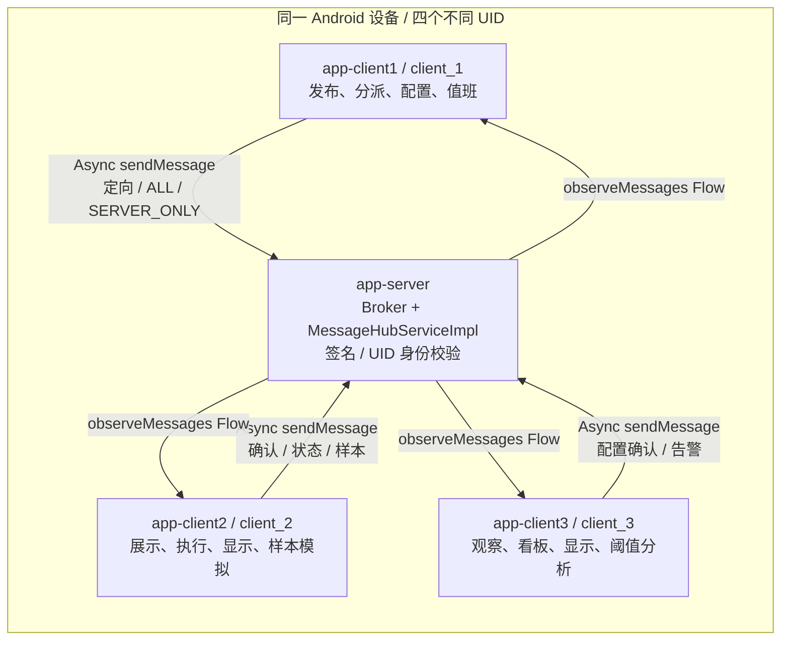
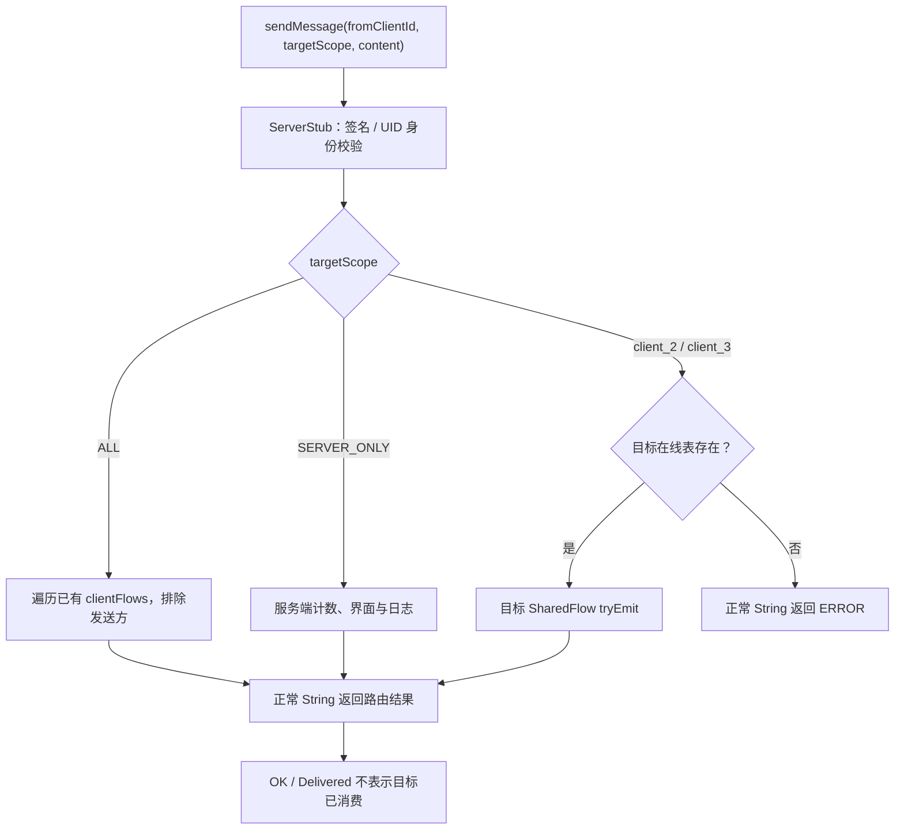
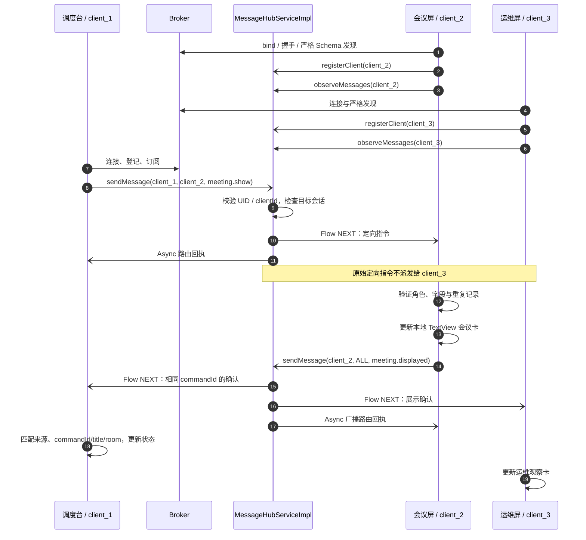
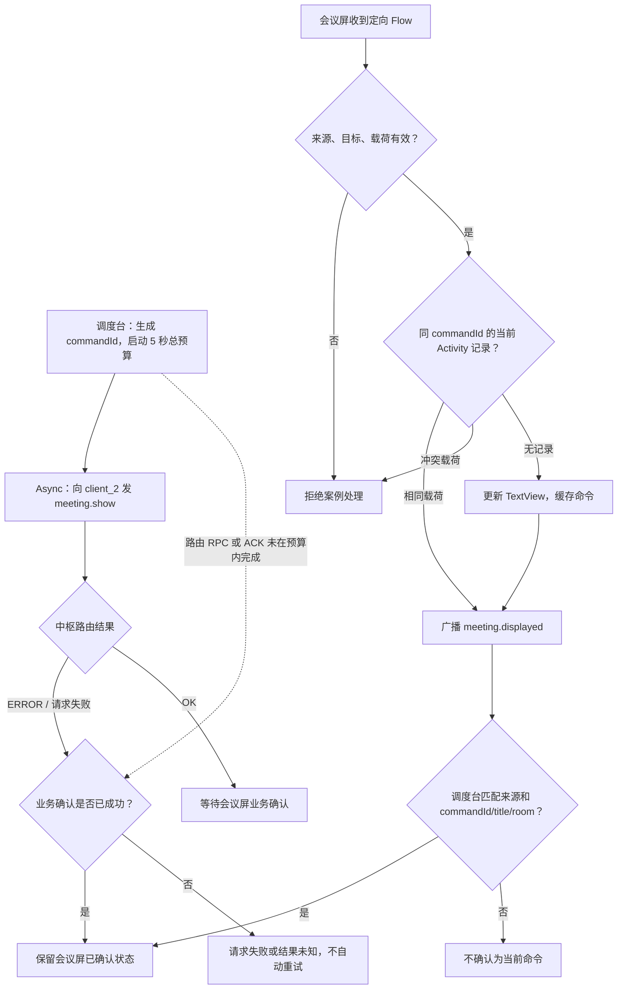
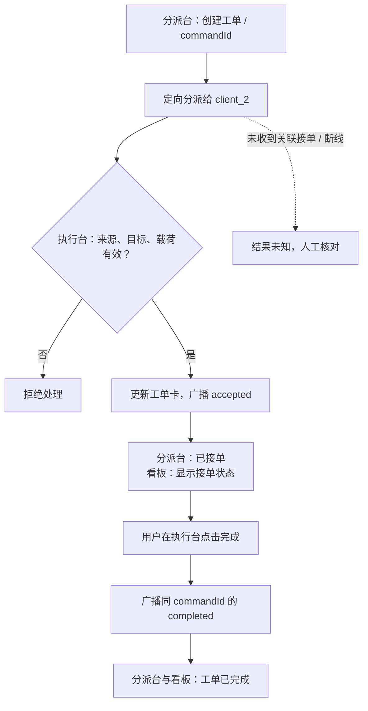
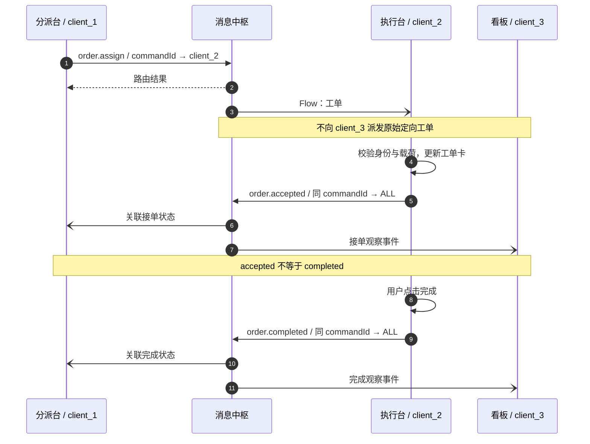
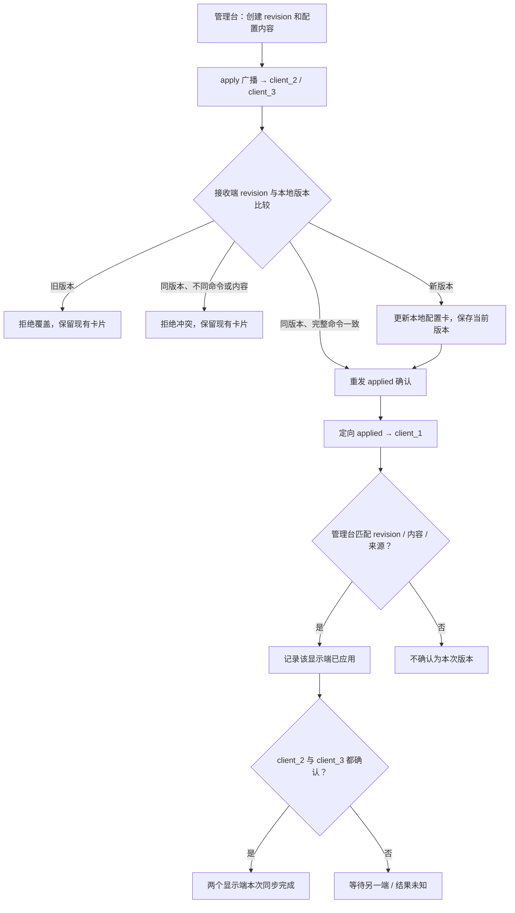
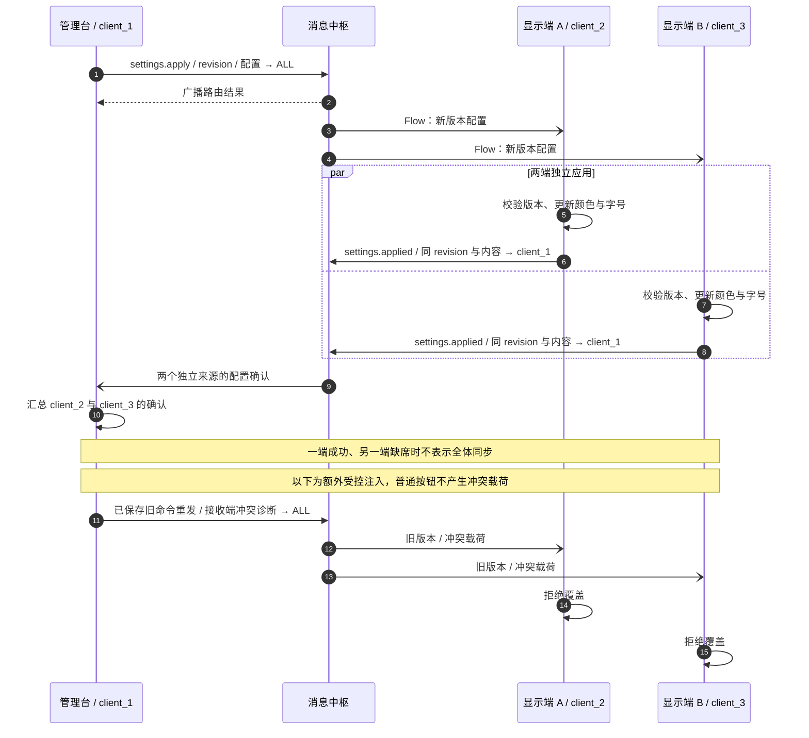
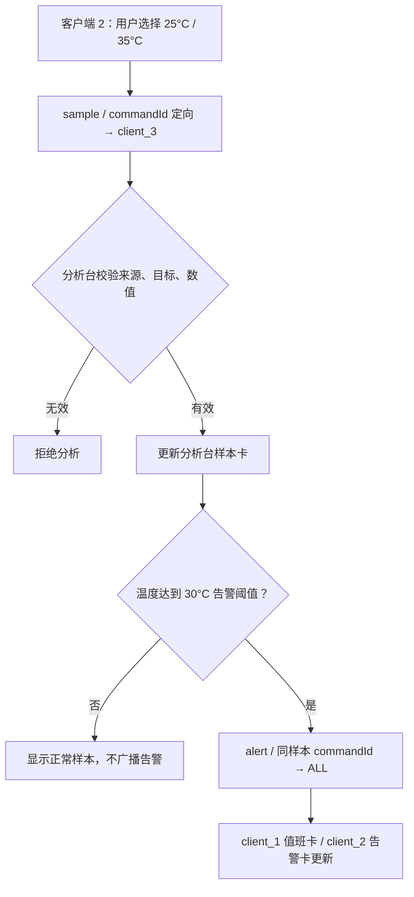
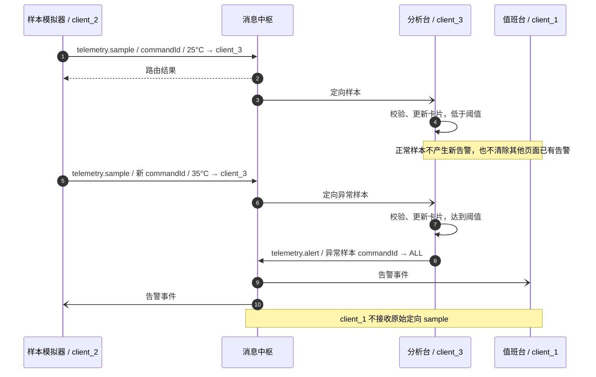

# ModernIpc 多 App 业务指南

发布版3.0.0-rc.1的产物与构建身份见[发布记录](releases/v3.0.0-rc.1/build-result.json)。下文设备测量与门禁仍属于各自历史APK；发布版设备验收NOT_RUN。

核对日期：2026-10-09。四个独立 APK 在**同一 Android 设备**上协作，共用 Broker、消息中枢和 Flow，客户端选择器提供会议通知、仓储工单、配置同步、遥测告警。业务卡均为本地 Activity 界面，没有驱动物理仓储设备、读取真实传感器或连接其他物理终端；跨设备协作需要额外传输层。

**当前证据**：最新五应用构建成功，当前四包业务链尚未安装验收，小米 `925c23bb` 的验证为 **NOT_RUN**。构建身份、旧跨包记录、自动脚本覆盖与待验收条件统一见[多 App 报告](benchmarks/Multi_App_Report.md)。以下流程和操作是源码行为与使用步骤，不是已通过的设备结果；框架回归见[回归报告](benchmarks/Regression_Report.md)，echo 与 AndLinker 测量见[性能报告](benchmarks/Performance_Report.md)。SDK 接入见[SDK 指南](ModernIPC_SDK_Guide.md)，内部调用链见[架构](ModernIPC_Architecture.md)。

| 场景 | client_1 | client_2 | client_3 | 业务终态或观察目标 |
| --- | --- | --- | --- | --- |
| [会议通知](#4-会议通知与展示) | 调度台发布会议、通知和上报 | 会议屏更新会议卡、广播确认 | 运维屏观察确认和通知 | 匹配 commandId/title/room 的 displayed；表示页面数据赋值。 |
| [仓储工单](#5-仓储工单分派接单与人工完成) | 分派台跟踪接单与完成 | 执行台接单、用户点击完成 | 看板观察接单和完成 | 同一 commandId 的 completed；accepted 仅为接单。 |
| [配置同步](#6-配置同步广播版本与逐端确认) | 管理台广播版本、汇总确认 | 显示端 A 应用配置 | 显示端 B 应用配置 | 两个目标确认相同完整命令；非跨 App 原子事务。 |
| [遥测告警](#7-遥测告警样本分析与告警广播) | 值班台显示告警 | 样本模拟器发温度、观察告警 | 分析台显示样本并判断阈值 | 指定异常样本的告警在 client_1、client_2 可见。 |

## 1. 共用架构、身份与生命周期

| 模块 | 包名 / 身份 | 部署要求 |
| --- | --- | --- |
| app-server | `com.cn.ipc.server.app` / 中枢 | 导出 ServerBrokerService，签名鉴权，UID 对应 clientId 白名单。 |
| app-client1 | `com.cn.ipc.client1` / `client_1` | 兼容签名、绑定权限、服务端包 queries、显式 ComponentName。 |
| app-client2 | `com.cn.ipc.client2` / `client_2` | 同上；独立 UID、进程和 Activity。 |
| app-client3 | `com.cn.ipc.client3` / `client_3` | 同上；独立 UID、进程和 Activity。 |



同签名只提供绑定与事务调用资格，具体 clientId 还由 [ServerBrokerService](../app-server/src/main/kotlin/com/cn/ipc/server/app/ServerBrokerService.kt)的包名/调用 UID 映射约束。权限名为 `com.cn.ipc.server.app.permission.BIND_BROKER`。业务接收端再验证 MessageEnvelope 的真实 `fromId` 和 `target`，不以 JSON 自报身份代替调用身份；房间发布、执行人等细分权限仍需应用设计。

### 连接与界面

[BaseClientActivity](../demo-client-common/src/main/kotlin/com/cn/ipc/client/common/BaseClientActivity.kt)持有共同 Activity scope、Controller 和一条消息订阅：

1. 显式绑定、握手，然后挂起预热服务 2001 的严格 Schema；客户端 minApiVersion/契约版本为 2。
2. 核对捕获的 Connected 实例与适配器后，Oneway 登记身份并启动 Flow。登记返回、“已启动消息订阅”和服务端 Flow 工厂日志不表示远端 collector 已就绪。
3. Flow 处理再次核对同一连接快照；每次业务发送捕获 generation，发送前核对，返回后核对同一 Connected 与适配器，旧操作不得借新连接提交结果。
4. 断线/状态切换取消本地未完成请求与确认 waiter。onDestroy 取消 Activity scope 并 dispose Controller；远端已启动 Binder 不可强制中断，副作用不会回滚。销毁时不保证远端已经注销。

场景切换只改变可见卡片，不重绑、不新增订阅。隐藏卡片仍按业务类型接收、赋值并确认，收到消息不自动切换场景。暂停/恢复案例订阅影响此 App 的全部场景和普通消息；恢复不补发旧事件。Activity 重建会丢失业务记录，切回现存 Activity 才能查看本次内存状态。

### 路由与回执



| 层次 | 表示什么 | 边界 |
| --- | --- | --- |
| 路由 String | 中枢处理了 ALL、定向或 SERVER_ONLY；离线可能正常返回 `ERROR:`。 | RPC 未抛异常不足以判断成功；`tryEmit` 不是投递确认。 |
| 业务 ACK | 接收端按真实角色、关联 ID 和完整载荷确认。 | 当前页面 TextView 已赋值，含隐藏卡；不证明首帧、用户看见、物理设备或数据库提交。 |
| 超时/断线 | 本地等待结束，结果可能未知。 | 不证明远端未执行；当前不自动重放。 |

[MessageHubServiceImpl](../app-server/src/main/kotlin/com/cn/ipc/server/app/MessageHubServiceImpl.kt)使用内存 SharedFlow：replay=0、额外缓冲 128、DROP_OLDEST，无订阅时不存待补发事件。框架本地 Flow 默认溢出报错并退订，也不能补回源头已丢的数据。在线表没有 TTL/死亡健康清理，登记或在线文本不是接收能力证明。SERVER_ONLY 仅更新内存计数与 UI/Logcat，不是持久审计。

## 2. 构建、启动与场景选择

准备 Android SDK、JDK 17、ADB，并唤醒解锁小米 `925c23bb`。固定该设备；缺席或锁屏不能记为通过。

```powershell
.\gradlew.bat :app-server:assembleDebug :app-client1:assembleDebug :app-client2:assembleDebug :app-client3:assembleDebug
adb -s 925c23bb install -r app-server\build\outputs\apk\debug\app-server-debug.apk
adb -s 925c23bb install -r app-client1\build\outputs\apk\debug\app-client1-debug.apk
adb -s 925c23bb install -r app-client2\build\outputs\apk\debug\app-client2-debug.apk
adb -s 925c23bb install -r app-client3\build\outputs\apk\debug\app-client3-debug.apk
adb -s 925c23bb shell am start -W -n com.cn.ipc.server.app/.ServerMainActivity
adb -s 925c23bb shell am start -W -n com.cn.ipc.client2/.Client2Activity
adb -s 925c23bb shell am start -W -n com.cn.ipc.client3/.Client3Activity
adb -s 925c23bb shell am start -W -n com.cn.ipc.client1/.Client1Activity
```

先开中枢，再开客户端 2、3，最后开客户端 1，观察连接并用实际消息确认接收路径。每个客户端从“场景：会议通知 / 仓储工单 / 配置同步 / 遥测告警”选择同一场景，按下文角色操作，再切换 App 查看卡片；同时通常只有一个 Activity 在前台，切页面不能证明全部 App 持续前台。

选择器 content-description 为 `business-case-selector`；新场景状态为 `scenario-<scenario>-status`，按钮为 `scenario-<scenario>-<action>`。Debug Intent 动作与可见按钮走相同业务路径，只在 debuggable、Connected、已本地发起登记与订阅时消费，extras 一次消费后清除；这个门禁不是远端就绪 ACK。

## 3. JSON 业务契约

四场景沿用 [IMessageHubService](../ipc-api/src/main/kotlin/com/cn/ipc/api/hub/IMessageHubService.kt)的 String content，没有新增 Binder 事务、服务 ID 或 wire Schema。业务 `v=1` 与 Binder 契约版本 2 独立维护。`commandId` 为业务关联 ID，Hub 每次路由生成的 MessageEnvelope.messageId 不能代替它。

### 会议载荷

```json
{
  "case": "meeting-board", "v": 1, "kind": "meeting.show",
  "commandId": "meeting-20261009-001", "title": "项目例会", "room": "会议室 A"
}
```

`case/v` 固定如上；kind 为 `meeting.show`、`meeting.displayed`、`meeting.notice`、`meeting.audit`。commandId 匹配 `[A-Za-z0-9_-]{1,96}`；title/room 非空白且各不超过 120 字符。确认保留原 ID/title/room，只改变 kind。源码：[MeetingBoardMessage](../ipc-api/src/main/kotlin/com/cn/ipc/api/hub/MeetingBoardMessage.kt)、[MeetingBoardDemo](../demo-client-common/src/main/kotlin/com/cn/ipc/client/common/MeetingBoardDemo.kt)。

### 工单、配置与遥测载荷

```json
{
  "case": "multi-app-scenarios", "v": 1,
  "scenario": "settings", "kind": "settings.apply",
  "commandId": "settings-20261009-001", "title": "显示配置",
  "detail": "dark", "revision": 1, "value": 18
}
```

| 字段 | 约定 |
| --- | --- |
| case / v | 固定 `multi-app-scenarios` / 整数 `1`；所有字段必填。 |
| scenario / kind | `work-order`、`settings`、`telemetry` 及下表对应事件。 |
| commandId | 匹配 `[A-Za-z0-9_-]{1,96}`；确认保留原 ID 和所有业务字段，只改变 kind。 |
| title / detail | 均非空白、各不超过 120 字符。 |
| revision | 正整数，解析只接受 Int/Long JSON 数字，再保存为 Long；不接受字符串或浮点强制转换。 |
| value | 整数且在 Int 范围；工单为 0，配置为 14/18，样本为 -40..125，告警为 30..125。 |

两类解析器均拒绝超过 4096 字符、错误版本、缺字段或非法类型/值。JSONObject 转义业务控制字符；外层 MessageEnvelope 仍以控制字符分隔，其他任意原始文本不能据此获得稳健编码保证。源码：[MultiAppScenarioMessage](../ipc-api/src/main/kotlin/com/cn/ipc/api/hub/MultiAppScenarioMessage.kt)、[MultiAppScenarioDemo](../demo-client-common/src/main/kotlin/com/cn/ipc/client/common/MultiAppScenarioDemo.kt)。

| 事件 | 真实来源与路由 | 关联约定 |
| --- | --- | --- |
| meeting.show | `client_1 → client_2` | 定向展示指令。 |
| meeting.displayed | `client_2 → ALL` | 原 ID/title/room；client_1 匹配待确认，client_3 观察。 |
| meeting.notice / meeting.audit | `client_1 → ALL / SERVER_ONLY` | 通知面向其他客户端；上报只在中枢。 |
| order.assign | `client_1 → client_2` | 默认 revision=1、value=0。 |
| order.accepted / order.completed | `client_2 → ALL` | 原 ID/title/detail/revision/value。 |
| settings.apply | `client_1 → ALL` | detail=dark/light、value=18/14，逐端应用。 |
| settings.applied | `client_2 或 client_3 → client_1` | 完整配置一致，管理台记录两个真实来源。 |
| telemetry.sample | `client_2 → client_3` | 手工预置温度；分析端校验数值。 |
| telemetry.alert | `client_3 → ALL` | 原异常样本全部字段；value≥30。 |

## 4. 会议通知与展示

client_1 是调度台，client_2 是会议屏，client_3 是运维观察屏。调度台发布定向会议，会议屏更新卡片并广播 displayed，运维屏只观察确认和公共通知。

### 时序与业务流程



路由回执与 Flow 事件来自不同回调路径，其抵达顺序不应被视为业务保证。若匹配的业务确认先到，后续路由回包超时或异常只记录为路由结果未知，保留已确认状态。生成 Async 入口默认 30 秒预算包含冷发现和 pending 等待；会议案例再用 5 秒外层截止覆盖自己的发送与确认全过程。


### 业务流程图



### 操作与状态规则

1. 三个客户端选择“会议通知”。client_1 点击“发布会议到会议屏”；client_2 查看对应会议卡，client_1、client_3 查看同 ID 的 displayed。
2. 点击“广播会务通知”，client_2、client_3 查看同 notice；ALL 排除发送方。
3. 点击“仅向中枢上报”，服务端 UI/日志查看同 audit，客户端窗口内不得出现该上报载荷。

show 从发送开始有 **5 秒总预算**，覆盖路由 RPC 与业务确认。调度台仅匹配来自 client_2、目标 ALL 且完整载荷一致的当前待确认消息；晚到或不匹配的 ACK 拒绝。会议屏缓存最近 64 条命令：同 ID/载荷重复到达时重发 ACK，同 ID 冲突拒绝更新。缓存随 Activity 销毁或淘汰而丢失，不是持久幂等或恰好一次执行。

show、notice、audit 的发布路由都受 5 秒本地预算约束；notice/audit 没有接收端业务确认。若 displayed 先于路由回包到达，后来路由超时或失败只记录 `route_result_unknown`，已确认状态保留。业务 ACK 仅为 TextView 赋值，不能当作物理会议屏验收。

**额外手工/诊断**：暂停 client_2 订阅后发布会议，检查调度台超时与恢复后无补发；同一 Activity 中重复相同 ID/载荷，再注入同 ID 冲突，检查重发 ACK 与拒绝。这些不属于当前自动脚本覆盖。持久会议、连接后快照、发布权限与真实显示确认需产品另补。

## 5. 仓储工单：分派、接单与人工完成

client_1 分派，client_2 执行，client_3 观察进度；中枢不持久保存工单。

这个场景区分“执行端已经接单”和“用户点击了完成”。不能把 sendMessage 的路由返回或 `order.accepted` 当作工单完成。`order.completed` 是业务终态，迟到的 accepted 不得把状态改回已接单；完成后的相同工单重复到达时重发 completed，同 ID 冲突载荷拒绝处理。这些记录仅存在当前 Activity 内存中。

### 业务流程图



### 时序图



### 操作与验收

1. 三个客户端选择“仓储工单”。客户端 1 点击“向执行屏下发工单”。默认标题为“出库复核工单”，详情为“复核 A-01 货位并完成出库”。
2. 在客户端 2 查看工单标题、详情和 commandId；客户端 1、3 应显示同一 ID 的已接单状态。
3. 在客户端 2 点击“完成当前工单”；客户端 1、3 应显示同一 ID 的已完成状态。
4. 观察窗口中客户端 3 可以收到 accepted/completed，但不应收到原始 assign。暂停客户端 3 订阅再操作，能演示看板缺失状态与恢复后无补发。

| 检查 | 合格证据 | 证明范围 |
| --- | --- | --- |
| 定向分派 | client_2 工单卡与真实来源/目标符合角色。 | 本地页面数据更新，不表示仓储硬件执行。 |
| 接单 | client_1、client_3 观察同 commandId 的 accepted。 | 执行端接单，不是工作完成。 |
| 人工完成 | 完成按钮触发后，两端观察同 commandId 的 completed。 | 演示用户操作终态，不证明物理任务完成。 |
| 定向隔离 | 同一采集窗口 client_3 没有 assign。 | 只覆盖该窗口。 |

**产品化边界**：需要数据库保存工单与状态、明确执行人权限、持久去重和状态转换规则。多执行端抢单、转派、取消、冲突处理、审计和物理完成证据需另外实现；当前 Activity 内存不承担这些保证。

## 6. 配置同步：广播版本与逐端确认

client_1 管理配置，client_2/3 独立显示；中枢不维护权威版本。

本场景演示状态同步：单调递增 revision 限制旧配置覆盖新配置。detail 的 `dark`/`light` 选择业务卡颜色，value 的 `18`/`14` 选择业务卡字号，只改变配置演示卡，不改变 App 整体主题或系统设置。ACK 表示该端的配置卡数据已赋值；两个端都确认才表示本次两个目标均完成，不是跨 App 原子事务。

发布端也做检查：新 commandId 的版本必须高于当前 Activity 此前生成的版本；同一 commandId 的冲突载荷直接拒绝，不发往中枢。已保存的完整命令可重发，接收端再独立检查是否已经过期。因此“发送端拒绝”与“消息到达接收端后拒绝”是不同验收项，日志不能混记。

### 业务流程图



### 时序图



### 操作与验收

1. 三个客户端选择“配置同步”。客户端 1 点击“同步主题与字号（深/浅交替）”。默认标题为“案例卡显示配置”；第一次 dark/18，随后 light/14，版本在当前 Activity 内递增。
2. 客户端 2、3 的配置卡应显示相同 revision、内容、颜色和字号；客户端 1 应分别收到两端确认。
3. 客户端 1 再次点击发布下一版本，观察两端独立更新和确认。相同 revision 的不同 commandId 也被视为冲突，即使主题和字号相同；只有完整命令相同才可重发确认。
4. **额外手工/诊断，非自动脚本覆盖**：用受控业务载荷分别验收发送端检查和接收端检查。重复发送已保存的旧命令可观察接收端忽略旧 revision；同 ID 冲突和新 ID 非递增版本会先被发布端拒绝，不能以此证明接收端冲突分支已执行。普通配置按钮没有旧版/冲突注入动作，自动脚本只验证两个合法配置版本。需单独检查接收端时，可在 client_1 的“自定义发送消息”卡选择 ALL，输入保留真实角色的完整 settings.apply JSON，改变版本或载荷；该通用发送路径绕过配置发布端的业务检查，必须单独记录为受控注入，不能混入正常配置验收。
5. 暂停任一显示端订阅再发布新版本，管理台不能显示两个目标都已同步；恢复后只有随后新发送的配置可被处理，没有自动快照补齐。

| 检查 | 合格证据 | 证明范围 |
| --- | --- | --- |
| 两端应用 | 两端对应配置卡 revision、内容、颜色与字号一致。 | 局部演示卡，不修改其他 App 的全局系统设置。 |
| 逐端确认 | 管理台匹配来自 client_2 和 client_3 的 applied。 | 两端独立完成，非原子提交。 |
| 拒绝旧版本 | 接收端记录拒绝，卡片 revision 和样式未被旧版本覆盖。 | 当前 Activity 的版本记录。 |
| 拒绝冲突 | 相同 revision、不同内容不改变已应用卡片。 | 不覆盖进程重启后的持久冲突识别。 |

**产品化边界**：需要权威配置存储、持久 revision、连接后快照拉取、目标清单和缺席端状态。若有多个发布者，要定义版本分配与冲突解决；若要求所有 App 同时生效，还需单独设计准备、提交和恢复协议。当前广播加 ACK 不具备原子切换保证。

## 7. 遥测告警：样本分析与告警广播

client_2 模拟样本，client_3 分析，client_1 值班；中枢不参与阈值计算。

25°C/35°C 来自演示按钮，非真实传感器读数或本机温度采样。本场景演示“数据由一个 App 产生、由另一个 App 解释、结果广播给其他角色”，阈值计算发生在客户端 3。

### 业务流程图



### 时序图



### 操作与验收

1. 三个客户端选择“遥测告警”。在客户端 2 点击“发送正常温度 25°C”。默认标题为“仓库温度”，详情为“按钮预置温度样本”。
2. 客户端 3 的“最近样本”卡显示对应 commandId 和 25°C；观察窗口内客户端 1 没有该样本的新告警。
3. 客户端 2 点击“发送高温 35°C”。客户端 3 显示异常样本，客户端 1、2 显示同一样本 commandId 的告警。
4. 客户端 1 不应收到原始 sample；客户端 3 是告警发送方，ALL 默认排除发送者，不能要求它经自己的 Flow 收到自身告警。

| 检查 | 合格证据 | 证明范围 |
| --- | --- | --- |
| 正常样本 | 分析台样本卡为 25°C，对应 ID 无新告警事件。 | 有限观察窗口，不证明告警引擎长期稳定。 |
| 异常样本 | 分析台为 35°C；client_1、client_2 告警卡对应同一 ID。 | 手工演示样本的单次链路。 |
| 来源与隔离 | sample 仅来自 client_2 并发往 client_3；alert 来自 client_3 并发往 ALL。 | 不覆盖其他任意角色或伪造载荷的全部安全场景。 |

**产品化边界**：需要真实数据源、采样时间与设备身份、数据缺失/乱序处理、持久告警、去重、抑制/滞回和解除规则，以及人员确认与升级路径。当前告警卡是最近事件记录；正常样本不等于一套持久告警的解除，不承担安全监控或硬件保护职责。

## 8. 验收入口、时间预算与产品化

业务终态图描述的是应用状态；框架终态图描述请求/订阅生命周期，两者不可相互代替。当前待验收详细条件、哈希和脚本阶段见[多 App 报告](benchmarks/Multi_App_Report.md)。

| 操作 | 本地预算与完成条件 | 未覆盖保证 |
| --- | --- | --- |
| 会议 show | 5 秒覆盖路由与 displayed。 | 首帧、物理屏、持久提交。 |
| 工单 assign | 5 秒覆盖路由与 accepted，completed 也可满足此等待。 | 不限制用户之后的人工完成时间。 |
| 配置 apply | 5 秒覆盖路由与两个独立 applied；缺席端保留为未知。 | 非原子提交，不自动补齐离线端。 |
| 工单 completed / 遥测 sample、alert | 5 秒路由等待；UI 终态需另行观察。 | 未设置所有观察端的消费 ACK。 |

确认先于路由回包到达时，会议、工单和配置都保留已经确认的状态；路由异常只记录为结果未知。连接变化取消本地 waiter，并标记未完成请求未知；不会撤销远端已经赋值的卡片。三个新场景分别最多一个主动操作和一个自动回复 waiter，新回复取消旧 waiter，已经开始的 Binder 仍可能完成，不能据此保证快速连续消息逐条可靠交付。业务去重与版本记录仅保存在当前 Activity，键缓存上限 64。

### 自动采集

两脚本默认只准备方案，`--execute` 才操作固定小米 `925c23bb`；用新 run-id，保留源码/APK 哈希、真实 UID/PID、关联业务日志与对应 UI。设备需安装刚构建且哈希匹配的四包并唤醒解锁。

```powershell
python docs/benchmarks/harness/capture_multi_app_case.py --run-id meetingprepare1
python docs/benchmarks/harness/capture_multi_app_case.py --run-id meeting1 --execute
python docs/benchmarks/harness/capture_multi_app_scenarios.py --run-id scenariosprepare1
python docs/benchmarks/harness/capture_multi_app_scenarios.py --run-id scenarios1 --execute
```

[capture_multi_app_case.py](benchmarks/harness/capture_multi_app_case.py)计划覆盖会议发布/确认、定向隔离、通知、仅服务端上报、client_3 暂停/恢复与后续新消息；[capture_multi_app_scenarios.py](benchmarks/harness/capture_multi_app_scenarios.py)计划覆盖工单接单/完成/完成后重复分派、两个合法配置版本、正常样本与高温告警，以及切换回工单终态。准备计划、构建与静态检查不等于设备 PASS。

配置旧版本/冲突、会议重复/冲突与接收端暂停、断线、Activity 重建、长期后台需额外受控验收；发送端拒绝非法配置不能冒充接收端冲突覆盖。会议日志 tag 为 `IPC_MULTI_APP_CASE`，新场景为 `IPC_SCENARIO_CASE`，应以 commandId、事件、真实来源/目标和 UI 共同核对；“连接成功”不能替代业务链。

如需业务性能，会议测发布→展示确认，工单分别测接单与人工完成，配置分别测两个端应用，遥测分别测分析与告警可见。人工时间不能作为 IPC RTT；echo 和 AndLinker 的历史性能也不能替代这些业务指标。

### 真实业务需要补齐

| 需求 | 可复用路径 | 应用需补齐 |
| --- | --- | --- |
| 会议/信息展示 | show → displayed，notice 广播 | 持久内容/版本、连接后快照、发布权限、首帧或物理显示验收。 |
| 多端执行任务 | assign → accepted → completed | 持久状态与去重、执行权限、抢单/转派/取消、物理完成证据。 |
| 多端配置 | revision apply → 逐端 applied | 权威持久版本、缺席端和快照策略；多发布者冲突与必要的提交协议。 |
| 遥测与告警 | sample → 分析 → alert | 真实数据/设备身份/时间、乱序缺失、持久告警、去重/滞回/解除、人员确认。 |
| 可靠消息与审计 | commandId、业务 ACK、SERVER_ONLY | 先落库再投递、重试与持久去重、订阅就绪与租约、持久审计。 |

新增第五个 App：引入公共契约与客户端运行时，声明绑定权限/包可见性并兼容签名；在服务端白名单加入包名→clientId；建立 Controller，严格预热后登记和订阅；为新角色定义允许接收的消息与权限。只改显示名称、JSON 或下拉项不会自动取得 Binder 身份。Activity 订阅也不证明长期无人值守运行，需独立验证后台宿主与设备策略。
