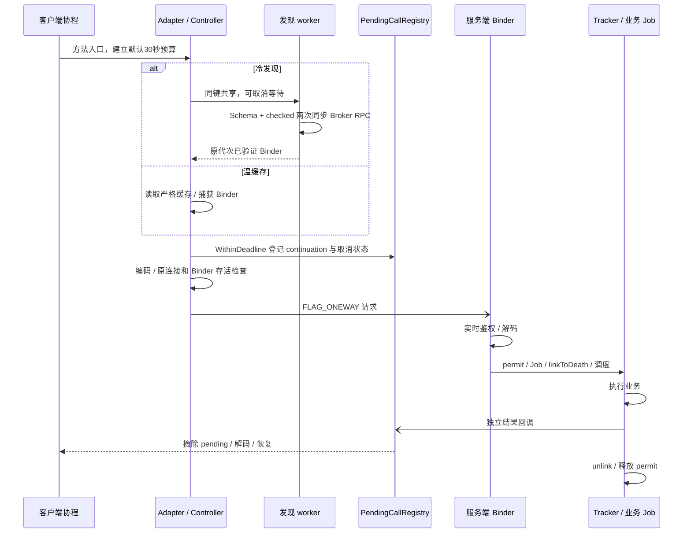

# ModernIpc 优化分析与实施顺序

发布版3.0.0-rc.1的产物与构建身份见[发布记录](releases/v3.0.0-rc.1/build-result.json)。下文设备测量与门禁仍属于各自历史APK；发布版设备验收NOT_RUN。

核对日期：2026-10-09。本文负责调用成本、优化取舍和下一步门槛；测量表、APK、原始数据与失败运行统一见[性能报告](benchmarks/Performance_Report.md)，功能门禁见[回归报告](benchmarks/Regression_Report.md)。当前四场景构建已通过，安装与设备验收未运行，见[多 App 报告](benchmarks/Multi_App_Report.md)。测试限定小米 `925c23bb`。

## 1. 先保证语义，再定位耗时


| 阶段 | 已落地源码 | 目前证据 |
| --- | --- | --- |
| 生命周期 | 独立控制 scope；close/dispose；原 Binder 清理；Stub 释放。 | 历史各版 22 项门禁；当前版本需重新执行。 |
| 请求与流终态 | Async 截止；取消状态原子处理；Flow NEXT/COMPLETE/ERROR 与溢出策略。 | 历史各版 8 项门禁；不证明源流可靠投递。 |
| 严格兼容 | 共享类型模型、逐事务 Schema、版本区间、双端检查与旧 Broker 明确拒绝。 | 历史 16 项兼容；Parcelable 字段和完整旧 APK 升级矩阵未证明。 |
| 冷发现/清理 | 锁外共享发现、入口截止、容器作废、最多4发现 worker 无队列。 | 5C8/4494 版独立 64 PASS / 5 DONE。 |
| 握手隔离 | 独立4握手 worker、可取消等待、Binding/连接/Job 身份拒绝晚结果。 | 在 4494 之后新增；402684 构建安装，当前源码构建通过；新增9项未实测。 |
| trace 与调度 | 默认关闭有界 trace；宿主可配置业务 scope，demo 默认 Default。 | 5C8/4494 成功 echo trace；4494 两轮 56,192 次测量全部成功，小包收益不稳定。 |

完整版本身份与当前 73 项回归目标由[回归报告](benchmarks/Regression_Report.md)维护。不能用旧版通过数验收新 APK，也不能删除鉴权、取消、死亡监听、终态或 Schema 检查后宣称等价优化。

## 2. 当前 Async 调用成本



源码：[客户端生成器](../ipc-compiler/src/main/kotlin/com/cn/ipc/compiler/ClientAdapterGenerator.kt)、[服务端生成器](../ipc-compiler/src/main/kotlin/com/cn/ipc/compiler/ServerStubGenerator.kt)、[Controller](../ipc-runtime-client/src/main/kotlin/com/cn/ipc/client/IpcConnectionController.kt)、[Pending](../ipc-runtime-client/src/main/kotlin/com/cn/ipc/client/PendingCallRegistry.kt)、[Tracker](../ipc-runtime-server/src/main/kotlin/com/cn/ipc/server/IpcRequestTracker.kt)。

首次严格发现的两个 Broker RPC 在专用 worker 执行；热缓存不重复发现或计算 fingerprint。缓存键包括连接代次、serviceId、最低版本及冻结 Schema。生成 Async 的预算从入口覆盖发现与 pending，底层 `callSuspendWithinDeadline` 不另建计时器，手写调用者必须提供外层截止。

结果恢复到调用方选择的协程上下文，库在回调中直接 `resumeWith`，没有再强制一次 dispatcher 切换。同包 echo 是同 UID 鉴权快速路径，不能用跨包签名查询解释其默认耗时。异 UID 每事务仍实时检查包与签名。

### 冷路径与关闭

[ServiceDiscoveryCache](../ipc-runtime-client/src/main/kotlin/com/cn/ipc/client/ServiceDiscoveryCache.kt)在 map/生命周期锁外执行 RPC；同一 Controller 同键共享，一个 waiter 退出不影响其他人，最后 waiter 退出放弃 flight。close/dispose 作废旧容器并唤醒等待者，旧结果不能发布到新容器。

[HandshakeExecutor](../ipc-runtime-client/src/main/kotlin/com/cn/ipc/client/HandshakeExecutor.kt)与发现池分开，每池进程/classloader 内最多4 worker、无队列。取消本地等待不能中断已开始的同步 Binder；4个永久阻塞 RPC 仍会占满各自预算。取消检查和下一次 RPC 之间存在竞态，不能承诺远端不执行。

## 3. 已实施优化及证明范围

| 改动 | 减少的工作 | 现有结论 |
| --- | --- | --- |
| 同 UID 鉴权快速路径与 authenticator 复用 | 不构造多余身份/包集合，不查询无用 PID。 | 局部 CPU/分配减少；历史 RTT 方向不一致。异 UID 授权结果不缓存。 |
| pending 三状态合为 AtomicInteger | 每请求原子状态对象由3个减为1个，保留单调 dispatched/aborted/cancelSent。 | 完整 Registry 近似少48 B/调用；三组竞态通过，未证明稳定 RTT。 |
| Async 发送前 guard | 去掉注册后的第二次完整缓存查询，检查原 Connected 身份、disposed、捕获 Binder 存活。 | 局部步骤近似少48 B、约少0.60μs线程CPU；两组合格 RTT 摘要反向。 |
| 冷发现/清理 | 从调用线程与缓存锁移出阻塞 RPC；入口统一预算。 | 修复 Main 响应与清理边界，不是温缓存 RTT 加速证明。 |
| 有界握手 | 防止控制 IO 上累积同步 handshake worker。 | 源码与构建验证；新增阻塞探针未验收。 |
| 可选专用短任务 dispatcher | 避开通用池部分调度竞争。 | 4494 版1024字符轮内配对较低，16字符第二轮有反向；保留默认 Default。 |
| 显式 Direct | 一次同步请求/回复，省 Job 调度、独立回调与 continuation 路径。 | 历史同 APK 短 echo 明显较低；这是不同调用语义，Hub 仍使用 Async。 |

上述局部分配差额不能直接相加为完整调用收益。微秒级局部 CPU 差不能解释某次毫秒级 RTT 摘要差。未知原因的 pending 6.411s 与鉴权 11.341s 长尾在[性能报告](benchmarks/Performance_Report.md)保留。

### 调度取舍

宿主给生成 Stub 提供 `coroutineScope`；SDK 不强制选择 dispatcher。短、无阻塞业务可评估专用线程，长计算或阻塞 I/O 需按业务分工，避免独占单线程导致其他请求排队。配置方法见[SDK 指南](ModernIPC_SDK_Guide.md#9-可选短任务调度配置)。

历史 Unconfined 消融只用于定位无挂起 echo 的调度成本，已恢复源码。它可能让业务在 Binder 线程执行，或让测试调用方在回调线程继续；不能作为通用生产配置。死亡监听消融没有稳定收益，不支持优先开发共享监听或删除监听。各段数据集中在[性能报告](benchmarks/Performance_Report.md)。

## 4. 用 trace 判断主要耗时

[IpcRequestTrace](../ipc-contract/src/main/kotlin/com/cn/ipc/IpcRequestTrace.kt)默认关闭，每进程最多16,384事件，窗口内内存记录与短 Trace marker，停止后集中导出文件或 Logcat。启用有分配和同步成本，trace-on 不等于无插桩性能。

诊断限隔离的单客户端/单 Controller：服务端 generation=0，callback identity 仅在本进程有效，没有新增 wire 会话身份。当前完整性验证只覆盖成功串行 echo，错误、取消、冷发现、Direct、Flow 未达到同等覆盖。

1. 先核对请求数、阶段完整性、双端 dropped、真实进程及前台资格。
2. 把应用事件与 Binder flow、sched Running/Ready/Sleep 关联；分开源/目标线程和重叠窗口。
3. 以完整请求 RTT 判断收益；阶段跨度含埋点与中间工作，分位数不相加，Sleep 不全部归为排队。
4. trace-on 定位后，用 trace-off 同 APK 的换序配对确认候选收益。

已有分析支持准入 CPU、服务端调度与客户端恢复都有成本，不能把历史波动指定为某一个环节的贡献。耗时表、内核关联与复算命令见[性能报告](benchmarks/Performance_Report.md)。

### 检查生成代码与字节码

已检查的 String echo deserializer 使用单例 `INSTANCE`；每请求 `new` 来自捕获 Binder/连接的 send/cancel 闭包。Parcelable reader 等捕获型 codec 要独立检查，不能推广所有类型。

```powershell
javap -c -p -classpath ipc-api/build/intermediates/compile_library_classes_jar/debug/classes.jar com.cn.ipc.api.test.IBenchmarkEchoServiceClientAdapter
```

KSP 模板里的 `listOf/setOf/joinToString` 是编译时工作；生成 Schema 初始化和方法体对象要按生命周期区分，不能直接算作每次 RPC 分配。

## 5. 剩余候选与必要门槛

以下均为**未实施候选**，没有计入已有测量：

| 候选 | 源码依据 / 可能减少的工作 | 实施前后必须验证 |
| --- | --- | --- |
| Tracker 的 started 放入 Key body | 当前 Key 外还有 AtomicBoolean；可评估 body 中 volatile Boolean，字段不得加入 equals/hash。 | 不可变 UID/callback/requestId 身份；never-start 错误兜底；取消前/中、scope取消、dispose、重复ID、回调死亡、唯一回复与permit归零。 |
| DeathRecipient 捕获已准入 Job | 死亡回调可省 tracker/key 捕获路径及一次 jobs查找；正常 RTT 收益未证明。 | 保留逐请求 link/unlink；旧ID复用、链接失败、死亡与完成竞争，只取消该次Job、只释放一次许可。 |
| authenticator 保存 ownUid | 避免每事务重复读取宿主 UID。 | 继续读取当前 Binder UID；异 UID 包/签名实时查询；同UID、同签名异UID、不同签名拒绝。 |
| 冷发现发送已冻结 expectedSchema | 评估省再次复制 Map 与摘要构造；只影响冷未命中。 | 校验与发送同快照；原Map修改、copy、不同版本/Schema隔离、额外事务、旧Broker拒绝与代次变化。 |
| 再精简 pending/闭包 | 先测 continuation、PendingCall、Long装箱和取消闭包分配占比。 | 截止起点、原子摘除、发送/关闭竞争、原Binder取消、无双重恢复；不依源码对象数推算固定RTT。 |

入口：[Tracker](../ipc-runtime-server/src/main/kotlin/com/cn/ipc/server/IpcRequestTracker.kt)、[鉴权](../ipc-runtime-server/src/main/kotlin/com/cn/ipc/server/CallerAuthenticator.kt)、[Controller](../ipc-runtime-client/src/main/kotlin/com/cn/ipc/client/IpcConnectionController.kt)、[冻结 Schema](../ipc-contract/src/main/kotlin/com/cn/ipc/ServiceSchema.kt)。优先完成当前握手与业务设备验收，再按 trace 和真实负载决定是否实施。

## 6. 下一轮验证

- 按[回归报告](benchmarks/Regression_Report.md)对当前 APK 完成握手9 + 既有64项；业务按[多 App 报告](benchmarks/Multi_App_Report.md)独立验收。
- 同 APK、同输入、预热后 ABBA/换序重复；报告成功数、失败、P50/P90/P99、最大值、线程CPU、进程分配，单列资格无效样本。
- 并发1/16/64/128及超限场景测成功吞吐、SERVER_BUSY、长尾、线程/GC。128是保护上限，增大限额不等于减少排队。
- 真实 sendMessage 的路由返回与业务确认分别测量；后台唤醒单独测。WakePathChecker 拒绝不能由热路径微优化解决。
- Direct、Oneway、CONFLATE 各自有不同语义；按产品需要选择后再测等价负载。Oneway 测服务端完成，不能只测提交。

仍需业务另做：持久消息/ACK/重放、在线健康、Flow订阅容量、Parcelable字段升级矩阵、会话身份、大载荷方案与幂等重试。架构细节见[架构](ModernIPC_Architecture.md)，与 AndLinker 的模型差异见[库对比](ModernIPC_vs_AndLinker.md)。归总前全文在[归档 ZIP](archive/pre-consolidation-2026-10-09.zip)。
