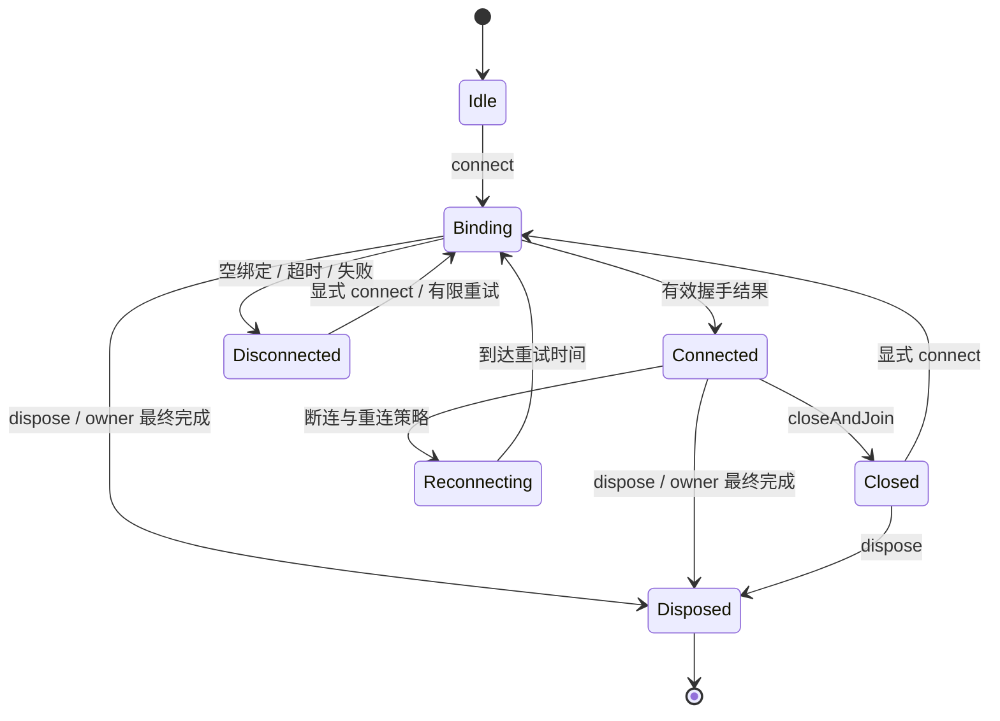
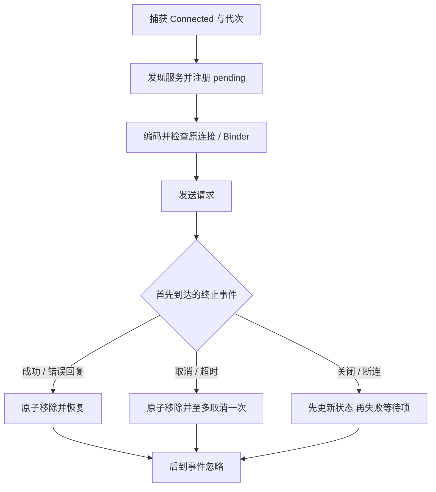

# ModernIPC 小米功能回归报告

发布候选3.0.0-rc.1另完成七个库产物与五个APK的统一构建和本地产物校验，详见[发布记录](../releases/v3.0.0-rc.1/build-result.json)。该发布版安装与小米验收NOT_RUN。本文保留此前开发阶段的APK、时间和证明范围。

更新日期：2026-10-09。设备范围为 Xiaomi 14 Ultra（`925c23bb`、`24031PN0DC`、Android 16）。本报告按生命周期、请求与流终态、协议兼容、冷发现与握手、请求 trace 汇总已有验证。性能数值与收益判断统一见[性能报告](Performance_Report.md)，跨应用业务验收见[多 App 报告](Multi_App_Report.md)。

**当前源码只完成构建验证。** 此前四场景开发构建的 demo APK 为 `22DAB0…`；指定小米设备在 2026-10-09 15:04 不可用，安装和设备验收均为 `NOT_RUN`。此前 `402684…` 握手隔离 APK 已安装，但设备进入 Dozing、锁屏，新增握手 9 项及该版本完整回归没有运行。已通过的 `52 PASS / 4 DONE`、`64 PASS / 5 DONE` 只属于下面列出的历史 APK，不能作为当前版本通过证明。

## 1. 构建与验收身份

工作区包含未提交修改。每份 `evidence.json` 或构建清单保存源码 SHA-256；设备记录同时核对本地 APK 与从设备拉回的 `base.apk`。版本前缀仅用于阅读，完整 SHA-256 如下。

| 版本 | demo APK SHA-256 | 已完成的验证与证据 |
| --- | --- | --- |
| 协议 v3 | `9645B21BBD43557E416DE6428015E7DA75B358E83D24AABB2433C49B6D2A8BA0` | Direct 标准异常头、类型与串行/并发正常请求；[原始记录](runs/2026-10-08-xiaomi14ultra/protocol-v3/) |
| 初次故障修复 | `A27BE6B70E9B4D4F962B4EABD9B2A6369DBE604D0E3C2594F522A8C24F6915BD` | 两轮各 6 组故障 PASS；[源码/安装身份](runs/2026-10-08-xiaomi14ultra/fault-paths/evidence.json) |
| 生命周期阶段 | `59ACE43ADCF5C9275AC62FDFC9DB366DECD530765BD371B47BC563D2DE10BAB3` | 22 PASS / 1 DONE；[证据](runs/2026-10-08-xiaomi14ultra/ordered-lifecycle/evidence.json) |
| 终态阶段 | `14124F10BA7417152BF7380E88F429638ED5BCA9C95142DE6F2846ABF6E150A1` | 8 PASS / 1 DONE；[证据](runs/2026-10-08-xiaomi14ultra/ordered-terminals/evidence.json) |
| 严格兼容阶段 | `CEA7244D318B31786621AD19B93EAEA7F9C0BD5969A7D1F5C5DAF472E3E24FD2` | 16 PASS / 1 DONE；[证据](runs/2026-10-08-xiaomi14ultra/ordered-compatibility/evidence.json) |
| Pending 状态优化 | `49C58DAA156DA8CEE1A79AAD11033D78DC65860680F3FEC27F70948AFC5DC4B4` | 同 APK 52 PASS / 4 DONE；另有三组各 12 项 Registry 竞态 PASS，设备前台条件没有覆盖整个性能窗口 |
| 发送前 guard | `30ED4B9762422AFEBF5DBA9DEEBB125C81921EA60C5C766A7B53EEAE01A1782D` | 同 APK 52 PASS / 4 DONE，四组前台 END 均有效；guardperf3/5 另有各 6 项 guard PASS |
| 初次冷发现修复 | `6F4162248E507B6762CE3C7984EC454480849D69EB2BC70B4DE6A007037E6067` | 2026-10-08 的 64 PASS / 5 DONE；早于完整 trace 和跨包入口适配 |
| 完整 trace 版本 | `5C8CECFDC5650E8186EC326DEAC916A9584755508BF555A5F48CE917AFBE20FC` | 64 PASS / 5 DONE；traceon4、traceoff1；crosspkg1 冷启动 smoke |
| demo 调度实验版本 | `4494F5299DF407EA3DB2DFE915B14057A39A6DCE5F4171217237FF8F88E1F0A4` | 再次 64 PASS / 5 DONE；traceon5；[最终核验](runs/2026-10-09-xiaomi14ultra/cold-trace-analysis/final-verification.json) |
| 握手隔离版本 | `40268409C9625500E63CAE5BB4B5114CE2EE1831013D0C35E221563ABED4B862` | 五应用 BUILD SUCCESSFUL、272 tasks、exit 0，五包安装哈希一致；[清单](runs/2026-10-09-xiaomi14ultra/handshake-build/build-install.json)。新增 9 项与完整设备回归 **NOT_RUN** |
| 四场景开发快照 | `22DAB06517B304F5F40264593CD94DC069E3A5DCF61C3BEB1F23293B1DAAF6A8` | 五应用 BUILD SUCCESSFUL in 3m 22s、272 tasks、exit 0；[构建清单](runs/2026-10-09-xiaomi14ultra/more-scenarios-build/build-result.json)、[设备状态](runs/2026-10-09-xiaomi14ultra/more-scenarios-build/device-state.json)。安装与设备验收 **NOT_RUN** |

`5C8` 与 `4494` 之间 35 个 runtime/compiler/contract/api 源文件 SHA 相同，变动为 demo 调度实验；这项源码等同核验不授权把结果移用到随后改动 Controller、增加 HandshakeExecutor 的 `402684`，或当前业务场景 APK。

### 功能门禁计数

| 门禁 | 52 项版本 | 64 项版本 | 当前计划 |
| --- | ---: | ---: | ---: |
| 生命周期 `IpcLifecycleProbe` | 22 | 22 | 22 |
| 请求与流终态 `IpcTerminalProbe` | 8 | 8 | 8 |
| 严格兼容 `IpcCompatibilityProbe` | 16 | 16 | 16 |
| 故障 `IpcFaultProbe` | 6 | 6 | 6 |
| 冷发现 `IpcColdProbe` | 未包含 | 12 | 12 |
| 握手隔离 `IpcHandshakeProbe` | 未包含 | 未包含 | 9，未运行 |
| 合计 | **52 PASS / 4 DONE** | **64 PASS / 5 DONE** | **73 PASS / 6 DONE 为目标，尚未达到** |

这里的 PASS 是探针断言数；三客户端 smoke、trace 完整性和业务场景另行计数，不加入 64 或 73 项。

### 完整回归原始证据索引

| APK | 生命周期 22 | 终态 8 | 兼容 16 | 故障 6 | 冷发现 12 |
| --- | --- | --- | --- | --- | --- |
| `49C58` | [lifecycleawake](runs/2026-10-08-xiaomi14ultra/ordered-final-lifecycle-awake/) | [terminalawake](runs/2026-10-08-xiaomi14ultra/ordered-final-terminals-awake/) | [compatawake](runs/2026-10-08-xiaomi14ultra/ordered-final-compatibility-awake/) | [faultawake](runs/2026-10-08-xiaomi14ultra/ordered-final-fault-awake/) | — |
| `30ED4B` | [lifecycleguard](runs/2026-10-08-xiaomi14ultra/ordered-guard-lifecycle/) | [terminalguard](runs/2026-10-08-xiaomi14ultra/ordered-guard-terminals/) | [compatguard](runs/2026-10-08-xiaomi14ultra/ordered-guard-compatibility/) | [faultguard](runs/2026-10-08-xiaomi14ultra/ordered-guard-fault/) | — |
| `6F416` | [lifecyclecold](runs/2026-10-08-xiaomi14ultra/ordered-cold-lifecycle/) | [terminalcold](runs/2026-10-08-xiaomi14ultra/ordered-cold-terminals/) | [compatcold](runs/2026-10-08-xiaomi14ultra/ordered-cold-compatibility/) | [faultcold](runs/2026-10-08-xiaomi14ultra/ordered-cold-fault/) | [cold2](runs/2026-10-08-xiaomi14ultra/ordered-cold-discovery-2/) |
| `5C8` | [lifecyclefinaltrace](runs/2026-10-09-xiaomi14ultra/ordered-final-lifecycle-trace/) | [terminalfinaltrace](runs/2026-10-09-xiaomi14ultra/ordered-final-terminals-trace/) | [compatfinaltrace](runs/2026-10-09-xiaomi14ultra/ordered-final-compatibility-trace/) | [faultfinaltrace](runs/2026-10-09-xiaomi14ultra/ordered-final-fault-trace/) | [coldfinal](runs/2026-10-09-xiaomi14ultra/ordered-final-cold-trace/) |
| `4494` | [lifecyclerelease](runs/2026-10-09-xiaomi14ultra/ordered-final-lifecycle-dispatch/) | [terminalrelease](runs/2026-10-09-xiaomi14ultra/ordered-final-terminals-dispatch/) | [compatrelease](runs/2026-10-09-xiaomi14ultra/ordered-final-compatibility-dispatch/) | [faultrelease](runs/2026-10-09-xiaomi14ultra/ordered-final-fault-dispatch/) | [coldrelease](runs/2026-10-09-xiaomi14ultra/ordered-final-cold-dispatch/) |

早期 [cold1](runs/2026-10-08-xiaomi14ultra/ordered-cold-discovery-1/) 是 10 PASS / 1 DONE，APK 为 `B968D1A784E95B57E459A43D8B13E0FFFD1EF58043995270A7AD19BBED3875C9`。它不是 `6F416` 的 12 项门禁，保留为较早版本记录。

## 2. 生命周期：关闭、重连与最终释放

原先清理任务借用调用方 scope，scope 已取消后 `launch` 可能不执行；绑定握手和缓存中的远程操作还可能延迟本地清理。Controller 使用独立控制 scope，owner Job 最终完成触发 `dispose`；各异步发布校验所属连接实例。服务销毁释放生成 Stub，取消请求、订阅与宿主 scope；计数在实际 Job 完成后移除。



图中的 Idle 为未发起连接阶段；具体公开状态与 API 契约见[架构](../ModernIPC_Architecture.md)及[SDK 指南](../ModernIPC_SDK_Guide.md)。`close/closeAndJoin` 允许同实例重新连接；`dispose/disposeAndJoin` 是永久释放，本地 collector 结束且再次连接被拒绝。每代 Flow observer 独立，退订捕获订阅时的 Binder/subId。

| 首轮生命周期验收场景 | 设备观察 |
| --- | --- |
| 同实例 8 轮 close / reconnect，锚定连接保持服务存活 | 每轮关闭 requests/subscriptions 为 0、事件静默；重连后订阅恰为 1，generation 递增 |
| 真实挂起请求关闭 | 客户端失败，服务端请求计数归零 |
| dispose | 外部 collector 结束、两端计数归零、再连接拒绝 |
| owner Job 最终完成 | 独立 scope 完成释放，请求失败、流结束、事件静默 |
| 最后绑定解除导致 Service 销毁 | 旧业务 Binder 仍存活，但 Stub 拒绝调用；重绑获得新 Stub，计数 0 |
| NullBindingService | 3 ms 进入 Disconnected，早于配置的 5000 ms 截止 |
| DelayedBindingService，200 ms 配置 | 206 ms 进入 Disconnected，迟到回调没有恢复连接 |

首轮详情见[生命周期日志](runs/2026-10-08-xiaomi14ultra/ordered-lifecycle/logcat.txt)。空绑定/迟到绑定的 pending 是本地合成项，不能称为真实业务 RPC；其余请求和订阅使用真实远端 Stub 计数。没有提前清空 map 制造归零。

owner 自动释放发生于 Job **最终完成**；非协作阻塞子任务可能推迟该时点，显式 dispose 独立于它。取消等待不能中断已经开始的同步 Binder RPC、撤销远端副作用或强制结束非协作业务。`onBindingDied` 具有源码/构建覆盖，尚未制造系统绑定失效事件验证。

## 3. 请求与流终态：一次恢复与清理

### 3.1 请求关联及取消

即时成功后 `!isActive` 曾被误判为取消，导致额外 cancel；改为按 `isCancelled` 判断。回复、断连和发送异常以原子移除 pending 取得恢复所有权，后到事件忽略。连接和 Binder 从同一 Connected 快照取得，取消发送至原 Binder，旧代请求不能借用重连后的 Binder。



Pending 状态从三个 AtomicBoolean 合并为一个 AtomicInteger：DISPATCHED / ABORTED / CANCEL_SENT 三个位，OR-CAS 只置位；只有已发送且已中止的 CAS 赢者执行取消。LAZY 服务端 Job 仍先登记与安装 completion hook 再运行；请求限额、鉴权与死亡监听保留。

初次故障版本两轮各 1000 次本地 Registry 回复/断连竞争，终态只接受 ok 或 lost，迟到结果拒绝；即时回包 cancel hook 为 0，显式取消和发送中取消各为 1。[故障原始记录](runs/2026-10-08-xiaomi14ultra/fault-paths/)。该竞争由门闩释放任务，覆盖实际调度出的交错；不穷举所有时序，也不证明远端 Job 或死亡监听已释放。

发送前 guard 以两次连接身份/dispose 检查包围捕获 Binder 的存活检查，替代重复完整服务查询。guard 失败移除等待项，不重放。guard 到 transact 仍可断连，必须处理事务失败；不能据此保证业务未执行。guardperf3/5 各 6 项覆盖真实 Binder、死亡 Binder 夹具、存活检查期间关闭、旧代拒绝/新代接受、生成 Async 返回和永久释放拒绝。死亡 Binder 是 IBinder 模拟，不是进程死亡实测。

### 3.2 流信封与截止时间

Flow 订阅回复采用 Android 标准异常头 + subId，客户端先 `readException`。工厂错误立即传播，成功订阅后立即回收请求与回复 Parcel；observer 和订阅 Job 保留到终止。NEXT code 1 维持布局，COMPLETE code 2 正常结束，ERROR code 3 携带 String 错误。默认满缓冲显式报错；`CONFLATE` 明确允许合并值。

| 首轮终态探针 8 项 | 设备观察 |
| --- | --- |
| 有限流 | 收到 1、2、3 后正常结束 |
| 业务运行时错误 | 收到 7 后以 `flow-runtime-error` 结束 |
| 默认 ERROR 慢消费者 | 消费 69 项后溢出异常，订阅归零 |
| CONFLATE 慢消费者 | 消费 4 项、末值 999，正常结束、订阅归零 |
| 显式取消 | 安静退出，两端清理 |
| 150 ms RPC 截止 | 155 ms；真实服务器 Job 从 1 到 0，pending 0 |
| 可识别 raw null 请求 | 立即错误回调 `Missing payload` |
| 坏 token 无回调 | 153 ms 截止，pending 0 |

数字来自[首轮终态日志](runs/2026-10-08-xiaomi14ultra/ordered-terminals/logcat.txt)，并非固定缓冲容量或时限承诺。`49C58` 最终复测分别为 159 / 157 ms，溢出消费 72 项，CONFLATE 消费 11 项、末值 999，均归零。

首轮截止只覆盖注册后的请求。冷发现修复之后，生成 Async 默认外层 30 s 预算包含发现和请求等待，Flow 发现也可超时；热命中没有嵌套发现计时器。该预算不使同步 Direct 或已开始的同步 transact 可中断。不可识别回调的非法帧依赖客户端截止。源 SharedFlow 若先 DROP_OLDEST 丢值，终态和 CONFLATE 仍不能提供可靠投递。

协议 v3 的 Direct 同样先写标准异常头；错误 token 为 SecurityException、空 String 为 IllegalArgumentException、业务异常维持 `bench-error` RuntimeException 消息，Int/Long/Boolean/ByteArray 回归通过。主线程保护由源码与构建确认，该轮没有实际执行主线程保护断言。Parcel 回收和 transact=false 分支没有独立内存或故障注入验收。

## 4. 协议兼容：严格发现与可传输错误

保留 ClientHello/ProtocolInfo 布局、Broker 原方法编号，新增 AIDL 显式编号 3 的 Schema 元数据与编号 4 的严格获取方法；实际 Binder code 是 FIRST_CALL_TRANSACTION + 编号，即 4/5。握手能力为客户端请求与服务器真实支持能力的交集。

KSP 共享 WireTypeModel 校验并生成双端 codec，IpcSchema 描述每个事务的参数、返回、模式、标志、响应信封、关联取消/退订事务。客户端本地校验后 Broker 再校验，允许服务端添加事务。缓存 key 含 generation、serviceId、minApiVersion、fingerprint；Schema 使用构造时不可变快照，热调用不重复 metadata RPC 或整份 hash。

| 兼容探针覆盖 | 最终 compat3 设备结果 |
| --- | --- |
| metadata | 17 个事务签名符合生成契约 |
| 旧 v1 单事务客户端子集 | 接受，真实 echo 成功；额外服务端事务允许 |
| 参数、返回、模式、信封、缺失事务、descriptor、未来版本 | Controller 与 Broker 都拒绝 |
| 同 serviceId，不同 Schema | 不借用已验证缓存，合法子集仍接受 |
| 修改 Schema 原 Map | 原指纹与 wire 快照不变；copy 新 Map 后两端拒绝 |
| 旧发现入口 | user floor 2 拒绝，echo floor 1 接受 |
| 100 次 Direct 热调用 | metadata=1、checked=1，无额外发现或 legacy RPC |
| 同 Stub 锚定后 close/reconnect | generation 递增，metadata/checked 从 1 到 2 |
| 模拟旧 Broker 缺 Schema 方法 | 严格失败，legacyFallbacks=0 |

compat3 为 16 PASS / DONE，最终 pending/requests/subscriptions 均 0，见[日志](runs/2026-10-08-xiaomi14ultra/ordered-compatibility/logcat.txt)。User/Hub 要求最低客户端契约版本 2，旧 `getService` 无法校验真实版本因此拒绝；Echo floor 1 仅为测试入口。业务校验使用 Parcel 可编码的 IllegalArgumentException，鉴权为 SecurityException，客户端不兼容为 IpcCompatibilityException。

Flow 标准异常头与终态升级要求双方同步升级；没有为旧客户端增加旧订阅格式兼容层。旧 Broker 覆盖为同 UID 方法可用性夹具，尚未验证历史 APK 完整升级矩阵或跨 UID 授权变更。Parcelable FQCN 是 opaque 类型标识，不能证明 DTO 内部字段布局兼容。apiHash 标签不参与严格 wire 校验，session/nonce 未绑定业务且不提供防重放。服务注册为静态，不支持运行中变更契约。

## 5. 冷发现、关闭清理与绑定握手

### 5.1 已修复与已测的冷发现路径

旧生成 Async 在调用线程同步发现 Broker，截止尚未开始；远程 RPC 位于缓存 `compute` 中，关闭 `clear` 可能等待同一 bin monitor，进而推迟解绑和 failAll。修复后的 [ServiceDiscoveryCache](../../ipc-runtime-client/src/main/kotlin/com/cn/ipc/client/ServiceDiscoveryCache.kt) 让远程发现脱离 compute/Controller Mutex，按同代次同 Schema 合并 Flight；进程内最多 4 个发现 worker、无积压队列。关闭替换并作废捕获缓存容器，晚返回必须校验代次和 Flight 仍被需要。

| coldrelease 12 项中的场景 | `4494` 上的观察 |
| --- | --- |
| Main 冷 Async，metadata 阻塞 300 ms | Main heartbeat 15/15，最终成功 |
| Async / Flow 150 ms 发现预算 | 156 / 171 ms 超时；Flow 无值自然结束，pending 0 |
| 主动取消发现 | cancelAndJoin 1 ms，释放 metadata 前远端仍阻塞 |
| 16 个同 key 等待者 | metadata=1、checked=1；随后 10 次热调用无额外发现 |
| 16 个等待者取消其中 1 个 | 另外 15 个成功，metadata=1、checked=1 |
| metadata 阻塞且另有已注册 hold，请求 close / dispose | 4 / 3 ms 完成本地清理；发现与原 pending 都失败，pending 0 |
| 重连，旧发现尚阻塞 | 新代先完成，旧调用失败；metadata=2、checked=1 |
| 注入发现失败后重试 | 第二次成功，无 legacy fallback |
| 错误 Schema / 合法重试 | 错误时 checked=0、legacy=0，合法重试成功 |
| 4 worker 阻塞，第 5 个新 Flight | 1 ms 快速拒绝；释放后重试成功，peakBlocked=4 |

[冷发现 CSV](runs/2026-10-09-xiaomi14ultra/ordered-final-cold-dispatch/cold-coldrelease.csv)、[日志](runs/2026-10-09-xiaomi14ultra/ordered-final-cold-dispatch/logcat.txt)与[身份](runs/2026-10-09-xiaomi14ultra/ordered-final-cold-dispatch/evidence.json)绑定该观察。12 项计数包含各独立断言，表格合并了相关场景。

最后等待者离开使 Flight 作废；已经开始的 Binder RPC 仍可阻塞 worker。4 个发现 worker 全阻塞会占满发现容量，第 5 个需要新 worker 的 Flight 被拒绝，同 key 等待者仍可共享已有 Flight。worker 在两个 RPC 之间检查有效性，但检查与下一次发送仍有竞态窗口。`lateChecked=0` 是调用方结束后、主动释放 metadata gate 前的受控观察，不是所有取消时序证明；10 s watchdog 没有参与此次清理完成。

同步 Direct/Oneway 在 Main 上冷发现立即失败，应先异步预热；同步业务 transact 仍会阻塞调用线程。[当前优化边界](../ModernIPC_Optimization_Analysis.md)说明如何选择调用方式。

### 5.2 握手隔离已实施，9 项设备验收待执行

业务发现池只覆盖 Connected 后的服务查询；此前 onServiceConnected 在控制协程的 Dispatchers.IO 执行同步 handshake。旧 RPC 即使超时解绑也会占 IO 线程，多个控制器可竞争清理执行容量。

[HandshakeExecutor](../../ipc-runtime-client/src/main/kotlin/com/cn/ipc/client/HandshakeExecutor.kt) 增加独立最多 4 worker、无队列的握手池。控制协程等待可取消 Deferred；关闭、解绑、绑定截止、owner 结束取消该连接握手等待 Job。发布必须匹配 ServiceConnection 身份、Binding 状态与登记 Job；旧结果丢弃。握手池与发现池分别最多 4 个，**不是全部阻塞 Binder 工作合计最多 4 个线程**。

[IpcHandshakeProbe](../../demo-app/src/main/kotlin/com/cn/ipc/demo/IpcHandshakeProbe.kt) 配合非导出、同 UID 的真实远端 latch 服务，计划覆盖：raw keep-binding 不占池、阻塞下 close、阻塞下 dispose、绑定截止与显式重试、有限重连、旧握手隔离、owner 取消、4 worker 饱和、容量恢复，共 9 项。该夹具 10 s watchdog 只作失控保护。

`402684` 已五包构建/安装一致；[power](runs/2026-10-09-xiaomi14ultra/handshake-build/power-after.txt)和[Activity](runs/2026-10-09-xiaomi14ultra/handshake-build/activities-after.txt)记录 Dozing/keyguard=true，因此没有执行新 probe、64 项重新回归、traceon6 或 crosspkg2。历史待执行清单见[next-steps.md](runs/2026-10-09-xiaomi14ultra/handshake-build/next-steps.md)。当前更多业务场景 APK 还需重新安装并冻结身份后才可执行这些计划。

## 6. 请求 trace 完整性验收


每侧缓冲上限 16,384 事件。默认关闭时不分配 Event、不取 TID、不加事件锁、不写日志；生成代码仍有数值快照与分支。开启时分配 Event、加锁与写 ATrace，测量后导出两个可靠文件，避免逐请求依赖 Logcat。

客户端关联键为 run/PID/callback/generation/requestId。callback identity 是进程内值，服务端不等于客户端；服务器不知道 generation，记 0。只在受控单客户端、单 callback、单代次、两独立进程、唯一 requestId 时按 requestId 跨端关联。wire envelope 未增加身份字段，多客户端不能直接套用这个简化关联。

| 采样 | 版本与结果 | 原始证据 |
| --- | --- | --- |
| traceon4 | `5C8`；1000 完整唯一请求，阶段单调；客户端 6000 + 服务端 5000 文件事件，应用丢弃 0 | [身份与采集元数据](runs/2026-10-09-xiaomi14ultra/ordered-trace-on4/capture-metadata.json)、[逐请求阶段](runs/2026-10-09-xiaomi14ultra/ordered-trace-on4/request-stages.csv) |
| traceoff1 | 同 `5C8`；1000 成功、事件 0、pending/requests 0 | [元数据](runs/2026-10-09-xiaomi14ultra/ordered-trace-off1/capture-metadata.json) |
| traceon5 | `4494`；1000 完整请求、11000 事件、应用丢弃 0 | [元数据](runs/2026-10-09-xiaomi14ultra/ordered-trace-on5/capture-metadata.json) |

`client_entry/client_resolved/server_receive` 补记原始 ns，计算用文件 ns；ATrace marker 写入时间仅供辅助。client_encode 含补记事件，server_queue 含 enqueue 记录/启动开销，client_resume 含回复记录、解码、pending 移除与恢复。traceon4/off1 为顺序各一轮，不能从 RTT 差值证明固定 trace 开销。完整性目前覆盖正常串行成功 Echo，未同等验证 Flow、Direct、错误、取消与所有冷发现分支。

Perfetto 按真实事件 PID/TID 与两向 Binder flow 关联：1000 请求对应 2000 唯一 flow，见[相关分析](runs/2026-10-09-xiaomi14ultra/ordered-trace-on4/correlated-analysis/summary.json)。客户端 PID 曾在进程名快照记为 usap64，不能按包名筛选后误判无事件。当前 buffer overwrite/discard、writer loss、每 CPU overrun delta 为 0；服务累计 `traced_chunks_discarded=1` 无法确定属于历史还是本轮，因此不宣称系统 trace 绝对零丢失。分段性能与线程解释统一见[性能报告](Performance_Report.md)。

## 7. 失败、环境无效与证据限制

| 保留记录 | 排除或修正原因 |
| --- | --- |
| [compat1](runs/2026-10-08-xiaomi14ultra/ordered-compatibility-initial-failure/logcat.txt) | Broker RemoteException 无法由 Parcel.writeException 编码，客户端空返回；修为可编码的标准异常 |
| [compat2](runs/2026-10-08-xiaomi14ultra/ordered-compatibility-legacy-fixture/logcat.txt) | 已通过 14 项后夹具误断未知 AIDL 方法必抛异常；实际可能 null，修不可用结果判断与 Controller null 检查 |
| [lifecyclefinal 中断](runs/2026-10-08-xiaomi14ultra/ordered-final-dozing/) | 只到第二轮重连，无完整 DONE；采集时 Dozing/STOPPED，未独立定位停顿原因 |
| [guardperf1](runs/2026-10-08-xiaomi14ultra/ordered-guardperf-1/) | 早期 `95ED9C…` APK；interactive=false，锁屏，前台门禁超时，未 START |
| [guardperf2](runs/2026-10-08-xiaomi14ultra/ordered-guardperf-2/) | 同早期 APK；4 项 guard 过后测试误认 Async `__error__` 会抛错，实际只在 Direct 生效；修夹具断言 |
| [guardperf4](runs/2026-10-08-xiaomi14ultra/ordered-guardperf-4/) | `30ED4B`；ON_PAUSE/FOCUS_LOSS，4 次无效观察；虽有 6 PASS/DONE，整轮环境无效，18 个 CSV 保留 |
| [traceon1](runs/2026-10-09-xiaomi14ultra/ordered-trace-on1/capture-metadata.json) | Perfetto config 位于设备不可读目录，未完成 |
| [traceon2](runs/2026-10-09-xiaomi14ultra/ordered-trace-on2/capture-metadata.json) | 设备 v49 不支持 record_thread_names 配置，未完成 |
| [traceon3](runs/2026-10-09-xiaomi14ultra/ordered-trace-on3/capture-metadata.json) | App 缓冲 11000 事件，Logcat 仅 10424，丢 576；严格校验失败，不用缺链样本计算结论 |

初次 fault1/fault2 使用较早探针，未纳入最终 faultfinal 两轮统计。功能成功不能推导任意后台时机均稳定完成；原 pending 性能阶段前台覆盖不完整，目录名 awake 不等于持续唤醒。

后续 run 使用 `foreground-coverage-v1`，目标 500 ms 采样、最长允许间隙 1000 ms，且生命周期、窗口焦点、interactive 与未锁屏条件有效；记录独立 dumpsys。该资格只证明已记录的应用/电源条件，不保证恒定 CPU 频率、无后台竞争或零 GC/JIT。无效记录保留，新运行用新目录。

仍需补证的路径包括真实在途业务遭进程死亡、跨 UID 取消/权限变更、长期死亡监听与资源计数、历史 APK 升级矩阵、DTO 字段布局，以及 trace 的错误/取消/Flow 分支。`maxReconnectAttempts=0` 在初次绑定失败与连接后 Binder 死亡分支仍有契约不一致风险；握手 probe 的零次/有限重连只覆盖绑定过程，不能视为该死亡分支已收束。guard 到 transact、有效性检查到下一个 Binder RPC 的并发窗口仍需明确错误边界。

## 8. 复现与当前待验收顺序

只使用 `925c23bb`。先连接、解锁小米并核实 Awake/keyguard=false，再构建、明确安装当前 APK，保存五包本地/安装哈希与源码清单。采集工具不会代替安装，不能把已保存的历史 APK 身份套用到当前设备。

```powershell
$env:JAVA_HOME='C:\Users\Work\.jdks\ms-17.0.16'
.\gradlew.bat :demo-app:assembleDebug :app-server:assembleDebug :app-client1:assembleDebug :app-client2:assembleDebug :app-client3:assembleDebug --offline --console=plain --max-workers=1 '-Pkotlin.compiler.execution.strategy=in-process'
adb -s 925c23bb install -r demo-app/build/outputs/apk/debug/demo-app-debug.apk
adb -s 925c23bb install -r app-server/build/outputs/apk/debug/app-server-debug.apk
adb -s 925c23bb install -r app-client1/build/outputs/apk/debug/app-client1-debug.apk
adb -s 925c23bb install -r app-client2/build/outputs/apk/debug/app-client2-debug.apk
adb -s 925c23bb install -r app-client3/build/outputs/apk/debug/app-client3-debug.apk

# 以下为2026-10-09复测示例；执行日不同须修改日期和输出目录。
# 目录已存在时换新stage/run，禁止覆盖。
$env:IPC_BENCHMARK_DATE='2026-10-09'
python docs/benchmarks/harness/run_guard.py consolidated-lifecycle lifecycleConsolidated IpcLifecycleProbe 22
python docs/benchmarks/harness/run_guard.py consolidated-terminals terminalConsolidated IpcTerminalProbe 8
python docs/benchmarks/harness/run_guard.py consolidated-compatibility compatConsolidated IpcCompatibilityProbe 16
python docs/benchmarks/harness/run_guard.py consolidated-fault faultConsolidated IpcFaultProbe 6
python docs/benchmarks/harness/run_guard.py consolidated-cold coldConsolidated IpcColdProbe 12
python docs/benchmarks/harness/run_guard.py consolidated-handshake handshakeConsolidated IpcHandshakeProbe 9
```

[run_guard.py](harness/run_guard.py) 固定设备，要求指定 PASS、DONE、有效前台 END，冻结日志与身份。它不会自动拉 cold/handshake 专项 CSV；用 Python subprocess 字节输出保存，避免 PowerShell 文本重编码：

```powershell
@'
from pathlib import Path
import subprocess
root = Path('docs/benchmarks/runs/2026-10-09-xiaomi14ultra')
for stage, name in (
    ('consolidated-cold', 'cold-coldConsolidated.csv'),
    ('consolidated-handshake', 'handshake-handshakeConsolidated.csv'),
):
    data = subprocess.check_output(['adb', '-s', '925c23bb', 'exec-out',
                                   'run-as', 'com.cn.ipc.demo', 'cat', 'files/' + name])
    (root / ('ordered-' + stage) / name).write_bytes(data)
'@ | python -
```

目标为六组有效完整记录、**73 PASS / 6 DONE**，且每组安装身份一致、无该 run FAILED。任何失败先保留现场并停止后续验收，修正后重跑新的目录；不能用不完整计数补齐目标。

之后追加 trace 开/关完整性与跨包 smoke。下面两份 capture 脚本默认只准备计划；显式 `--execute` 才操作设备：

```powershell
python docs/benchmarks/harness/capture_request_trace.py docs/benchmarks/runs/2026-10-09-xiaomi14ultra/ordered-trace-consolidated --run-id traceConsolidated --seconds 20 --force-stop --execute
python docs/benchmarks/harness/analyze_request_trace.py docs/benchmarks/runs/2026-10-09-xiaomi14ultra/ordered-trace-consolidated --run-id traceConsolidated --single-client --trace-processor .gradle/trace-tools/trace_processor_shell.exe
python docs/benchmarks/harness/capture_request_trace.py docs/benchmarks/runs/2026-10-09-xiaomi14ultra/ordered-trace-consolidated-off --run-id traceConsolidatedOff --seconds 20 --force-stop --extra-bool ipc_request_trace=false --execute
python docs/benchmarks/harness/analyze_request_trace.py docs/benchmarks/runs/2026-10-09-xiaomi14ultra/ordered-trace-consolidated-off --run-id traceConsolidatedOff --single-client --trace-processor .gradle/trace-tools/trace_processor_shell.exe
python docs/benchmarks/harness/capture_cross_package_smoke.py --run-id crosspkgConsolidated --execute
```

跨包 smoke 不证明路由投递。会议、工单、配置与遥测的完整 UI/业务确认计划、具体边界与更多验收入口见[业务指南](../ModernIPC_Business_Interaction_Guide.md)及[多 App 报告](Multi_App_Report.md)。所有复测结果仍应绑定各自 APK/源码和运行条件，性能变化再按[性能报告](Performance_Report.md)的方法比较。
